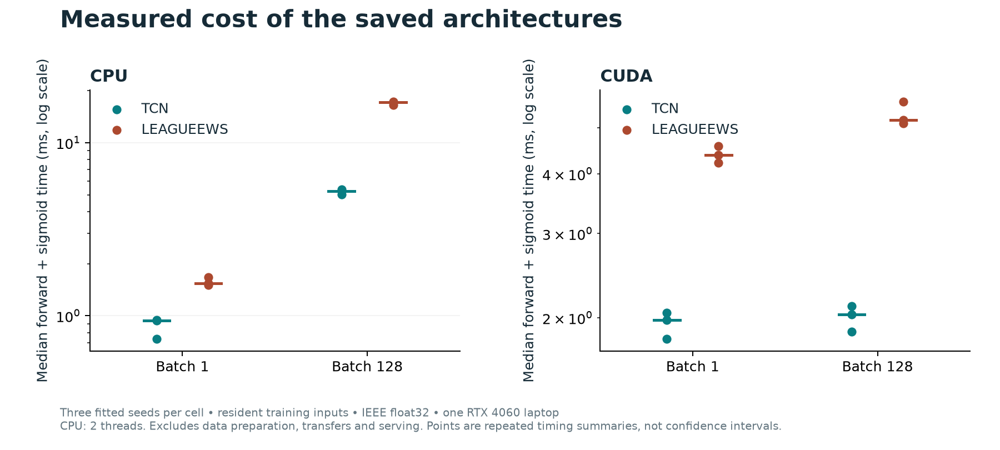

# LeagueEWS: making early-warning claims testable

**Keerthivasan Kannan · Applied machine learning and research engineering**

LeagueEWS investigates whether Baron, Dragon and teamfight events can be warned
about early enough to be useful. The project connects data auditing, temporal
modeling, GPU execution and statistical evaluation. Its central engineering
decision is to evaluate the warning a user would actually receive, rather than
promote a high row-level classification score.

[Two-page project brief](../reports/publication-package-2026-10-07/leagueews-project-brief.pdf)
· [Seven-page working paper](../paper/leagueews-2026-10/leagueews-working-paper.pdf)
· [Exact evidence](../reports/publication-package-2026-10-07/evidence.json)
· [Reproduction guide](../reports/publication-package-2026-10-07/reproduce.md)

## The problem and the engineering response

The original MSc implementation combined a TCN, bidirectional GRUs and
cross-attention. An audit found that overlapping windows and augmented copies
crossed partitions, final match statistics entered the inputs, and displayed
warnings used future scores. Those problems undermine the interpretation of
the original scores. The original work remains available; its metrics are not
presented as the performance of the corrected system.

The continuation rebuilds the task around whole-match chronological splits,
training-only normalization and native observations. Checkpointed training
preserves model, optimizer and random-number state. Hashes bind data, code,
models and policy outputs. Committed release checks separate fitting from
scoring. A vectorized warning evaluator is checked against a separate scalar
implementation, including cooldown, late warnings and one-to-one event credit.
([Source audit](notebook-continuation.md);
[execution record](../reports/warning-risk-2026-10-07/reproduce.md).)

The completed program contains 30,000 development matches, 879,998 genuine
observed rows and 69 preserved neural fits. The latest predictive study records
740 passing software tests, one skip and 810,000 full independent replay checks.
Repeated rows, fitted seeds and software checks are not independent scientific
replications. ([Data scope](league-research-scope.md);
[fit inventory](../reports/matched-optimization-2026-10-06/research-report.md);
[verification](../reports/warning-risk-2026-10-07/research-report.md).)

## What the research actually found

The strongest history control retains current features and genuine timer
history. Additional past non-timing state improves short-lead macro recall by
0.533 percentage points [0.374, 0.696], with lower aggregate warning burden.
The improvement is strongest for Baron and teamfight; it is not uniform across
events and lead windows. ([History study](../reports/clock-history-2026-10-04/research-report.md).)

Shared learning is task-dependent. Under useful-lead supervision and the
original task weights, the joint encoder loses 0.664 longer-lead macro points
[0.397, 0.925] relative to independent encoders. Equal weighting subsequently
recovers part of the Baron deficit, so the evidence does not establish that
all shared representations are intrinsically harmful.
([Sharing study](../reports/timely-sharing-2026-10-05/research-report.md);
[weighting study](../reports/timely-optimization-2026-10-05/research-report.md).)

After matching event weights, the hybrid's short-lead TCN advantage is 0.242
points [0.130, 0.354]. The hybrid has about 3.14 times the parameters, and regional
consistency remains unresolved. This is a much narrower result than the large
hybrid–GRU margin suggested. ([Matched controls](../reports/matched-optimization-2026-10-06/research-report.md).)

A conservative capped policy produces zero observed nominal-budget violations
across 720 regional cells but costs the hybrid 1.818 short-lead and 3.114
longer-lead macro recall points. The gain is observed budget compliance, not
an improved prediction frontier or a certified adaptive-search guarantee.
([Policy tradeoff](../reports/warning-risk-2026-10-07/research-report.md).)

All these findings use repeatedly inspected calibration. Intervals condition
on fixed fits and policies. The reserved future-patch test is unopened.

## Systems measurement and a numerical failure caught before publication

The saved hybrid's batch-one forward-plus-sigmoid median is 1.540 ms on CPU and
4.377 ms on the RTX 4060 Laptop GPU, summarizing the three fitted-seed medians.
The corresponding TCN values are 0.940 and 1.979 ms. At batch 128, the hybrid
medians are 17.157 ms on CPU and 5.191 ms on GPU. Small batches are therefore
faster on CPU in this measurement, while GPU batching improves throughput.
This illustrates why device choice should follow the workload.

The initial CPU/GPU agreement check failed because cuDNN TF32 was enabled.
Explicit float32 reduced the first fit's maximum probability difference from
0.000214 to 0.000000387; all six saved fits then passed the unchanged tolerance.
The failed first run and correction remain in the record. No prediction-study
results were rewritten. These are measurements on one laptop with resident
training inputs, two CPU threads, uncontrolled thermal/background conditions
and no serving, transfer or preprocessing time.
([Protocol amendment](../reports/publication-package-2026-10-07/runtime-protocol-v2.md);
[all 2,400 timings](../reports/publication-package-2026-10-07/runtime.json).)

## Review paths

| Review interest | Evidence to inspect |
|---|---|
| Causal features and leakage detection | [Notebook continuation and original audit](notebook-continuation.md) |
| PyTorch temporal modeling | [Hybrid and baseline implementation](../src/league_ews/notebook_ews.py) |
| Reliable GPU execution | [Checkpointed compact-data runner](../scripts/run_compact_notebook.py) |
| Numerical debugging | [Precision correction and preserved failure](../reports/publication-package-2026-10-07/runtime-protocol-v2.md) |
| Evaluation correctness | [Vectorized replay and separate scalar oracle](../scripts/warning_risk.py) |
| Statistical judgment | [Completed comparisons and claim decisions](publication-decision-2026-10-07.md) |
| Honest scientific writing | [Working paper](leagueews-paper-draft.md) and [bounded confirmation protocol](leagueews-confirmation-protocol.md) |

## Concise project description

LeagueEWS is an AI-assisted research-engineering project that rebuilds a League
of Legends event predictor around causal inputs, reproducible GPU experiments
and chronological warning evaluation. Across 69 neural fits, it separates
history, supervision, task-sharing and policy effects. The contribution is an
auditable empirical investigation, including negative results and measured
compute tradeoffs; a new-method breakthrough and publication acceptance have
not been established.

Suggested résumé bullets, subject to the project owner's verification:

- Built an AI-assisted PyTorch research pipeline for three League event types,
  with 30,000 development matches, checkpointed GPU training and source/data
  hashes linking 69 neural fits to their evaluations.
- Evaluated warnings using chronological cooldown and one-to-one event credit;
  checked the latest policy study with 810,000 independent full replay comparisons
  and preserved both positive and negative model findings.
- Investigated history, loss alignment and negative transfer with matched
  controls; quantified CPU/GPU inference cost and diagnosed a TF32 consistency
  failure before publishing the runtime comparison.

This is a working paper and portfolio case study, not an accepted publication
or a deployed player product. Original project ownership and notebooks belong
to Keerthivasan Kannan. Material Codex assistance with implementation, analysis,
debugging and writing is recorded in [the AI-use disclosure](ai-usage.md).
Human verification for a journal submission remains pending.
