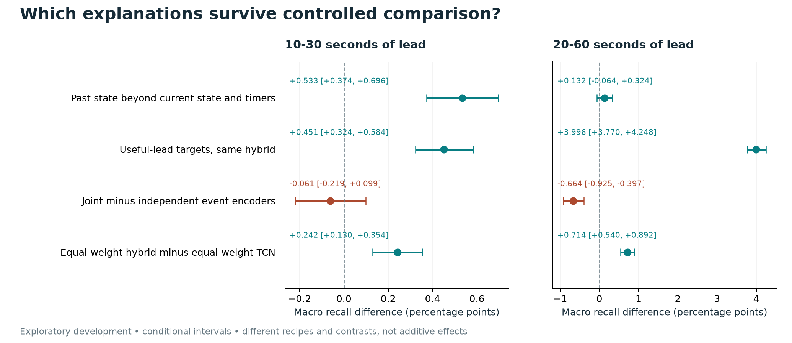

# Useful Early Warnings in League of Legends: History, Supervision and Alert Costs

**Keerthivasan Kannan · Exploratory working paper · Revised 8 October 2026**

This revision consolidates completed development studies. It adds no training,
policy selection or outcome evaluation. Future-patch confirmation is pending.

## Abstract

Accurate row-level event scores do not establish useful advance warnings. We
revisit LeagueEWS, a temporal hybrid for Baron, Dragon and teamfight prediction,
after auditing information leakage and retrospective alert selection in its
original evaluation. The continuation uses 24,000 training matches and 6,000
development calibration matches, chronological warning replay, three fixed
training seeds and paired whole-match uncertainty. Across controlled studies,
past non-timing state adds 0.533 percentage points of macro recall with
10–30 seconds of lead beyond genuine timer history and current state
(conditional 95% interval 0.374–0.696). Beneficial sharing is not uniform:
with useful-lead targets, joint training loses 0.664 points at 20–60 seconds
relative to independent event encoders (−0.925 to −0.397). After matching loss
weights, the hybrid's short-lead advantage over a TCN is 0.242 points
(0.130–0.354), with unresolved regional consistency. A capped risk-screened
policy eliminates observed nominal-budget violations across 720 regional
evaluation cells but reduces hybrid recall by 1.818 short-lead and 3.114
longer-lead points. These exploratory results distinguish history information,
supervision and policy effects from broad architecture claims. They do not
establish a new learning method, certified risk control or untouched-patch
generalization.

## 1. Research question

The original LeagueEWS project attributed gains in three-event prediction to
temporal buildup and shared learning. Its saved evaluation cannot test that
explanation: scaling preceded splitting, overlapping windows and their jitter
copies were randomly divided, and end-of-match statistics entered the feature
pool. Its displayed alerts also used future scores to select retrospective
peaks. We preserve the original notebooks and results as historical artifacts
and evaluate a descendant with prediction-time-available inputs and explicit
information boundaries.
The original report and notebook disagree on several saved metrics; none of
those historical scores is treated as newly reproduced evidence.
([Notebook and report audit](notebook-continuation.md).)

Our question is which proposed explanations survive controlled comparisons:
past information beyond current state and timers, aligned warning targets,
shared supervision, hybrid architecture, and warning-policy selection. These
are related but distinct explanations. Better performance after changing one
does not establish the others.

### 1.1 Contributions and scope

The paper contributes (i) an auditable three-event evaluation in which an alert
must be emitted using information already available, (ii) controlled evidence
separating history, target alignment, sharing, weighting and architecture, and
(iii) a measured account of warning-budget and model-cost tradeoffs. The public
artifacts expose both favorable and adverse findings and preserve the historical
evaluation they correct. These are empirical and reproducibility contributions;
none of the individual modeling or risk-control components is claimed as new.

### 1.2 Relationship to prior work

| Prior work | Established contribution relevant here | What this study examines |
|---|---|---|
| Yang et al. [1] | Temporal MOBA event prediction and attribution in Honor of Kings | Three League event definitions with chronological warning replay; no cross-game score comparison |
| Vardakis et al. [2] | Publisher abstract describes imminent League player-death prediction with a Temporal Fusion Transformer | Baron/Dragon completions and teamfight episodes; detailed full-text comparison remains pending |
| Yèche et al. [3] | Early-event prediction and alarm prioritization evaluated beyond time-step scores | How lead-window supervision and alert selection alter this game's warning utility |
| Yu et al. [4] | PCGrad projects conflicting task gradients | Whether the established method adds benefit beyond equal task weights in this fixed recipe |
| Angelopoulos et al. [5] | Learn then Test frames risk calibration as hypothesis testing | Recall cost of a capped fixed-sequence screen; no certification after adaptive development |

Differences in tasks, data access and endpoints prevent a shared leaderboard.
This focused comparison establishes the scope of the empirical question, not
priority for temporal event forecasting or an exhaustive literature review.

## 2. Data, targets and information availability

The audited archive covers Europe and Americas routes. Whole matches are split
before sequence construction, and normalization is fitted on training data.
Earlier and later calibration halves each contain 1,500 matches per region.
Repeated inspection of both halves makes this adaptive development; the reserved
test has not been evaluated.
([Data boundary](league-research-scope.md);
[initial methods](../reports/neural-continuation-2026-10-01/methods.md).)

**Table 1. Cohort and information boundary.** Counts are whole matches and native
observations. The calibration halves below partition the same 6,000 matches;
they are not additional data.

| Partition | Patches | Matches | Native rows | Role |
|---|---|---:|---:|---|
| Training | 16.12–16.15 | 24,000 | 704,967 | Fit normalization and model parameters |
| Calibration | 16.16 | 6,000 | 175,031 | Earlier 3,000 select policies; later 3,000 evaluate |
| Reserved test | 16.17 | 6,000 | Not inspected | Future-patch confirmation; payloads sealed |

The three targets are Baron completion, Dragon completion and the registered
teamfight kill episode. Objective labels come from objective-kill records;
they are not objective engagement onsets. Consequently, the paper makes no
claim of forecasting an objective before its first attack. Inputs use audited
current and past information, with explicit ages, masks and missingness.
Eight genuine frames retain approximately seven minutes of history at the
usual observation cadence. No interpolated row is represented as a new
observation. Sparse observation cadence remains an information limitation.
([Label implementation](../src/league_ews/labels.py);
[input adaptation](notebook-continuation.md).)

## 3. Warning endpoint and statistical analysis

At an observed timestamp, a policy emits a warning if the score exceeds its
selected threshold and the event-specific 60-second cooldown permits it.
Warnings are emitted chronologically; future scores cannot replace earlier
actions. A warning receives credit for the earliest unmatched event within
its prediction horizon. Each event is credited once. A timely warning precedes
the event by 10–30 seconds for the primary endpoint or 20–60 seconds for the
secondary endpoint. Warnings with shorter lead are late; warnings without a
credited event in the horizon are false. Both incur warning cost.

For event type e, recall is the total timely credited events divided by the
total events, including events without an observed decision opportunity.
Burden is false-plus-late warnings divided by matches. Macro recall and burden
average event-specific quantities equally. Budgets apply separately to each
event and region; they are not one shared attention budget for all three
events. The two lead-window policies are evaluated separately, not as one
simultaneously deployed system.
([Chronological replay and independent reference](../scripts/warning_risk.py).)

Thus, **recall = timely credited events / all events** and **burden =
(false warnings + late warnings) / matches**. Each macro quantity averages the
three event types. Differences in recall are absolute percentage points.

The initial continuation used a common deterministic threshold at budget one.
Later studies predeclared four early-calibration budgets, 0.25, 0.50, 0.75 and
1.00. Their primary operating comparison uses region-specific mixtures of
whole-match threshold policies to match expected early cost. A mixture selects
a policy for a whole match; it does not switch thresholds using future match
outcomes. Reported mixture results are expected policy counts. Fine-grid
common deterministic policies provide separate sensitivity analyses. Equal
early cost does not imply equal later cost. Estimates under these policies
are labeled separately throughout the paper.
([Operating-point study](../reports/warning-efficiency-2026-10-03/protocol.md);
[fine-grid study](../reports/dense-policy-2026-10-04/protocol.md).)

Each model is fitted with three fixed seeds. Paired intervals use 2,000
whole-match bootstrap draws stratified by region, with the same sampled
matches shared across models, events, budgets and seeds. Counts from fixed
fits are averaged within the analysis; rows, seeds and repeated budgets are
not independent match samples. All intervals below are pointwise conditional
95% intervals. They omit refitting, policy selection and the adaptive research
search; secondary intervals are not multiplicity-adjusted. These intervals
must not be read as confirmatory significance after selection.

## 4. Controlled comparisons

The continuation retains LeagueEWS's residual dilated TCN, squeeze-excitation,
stacked bidirectional GRUs, cross-attention and temporal pooling. Bidirectionality
within a window entirely preceding the prediction cutoff is permissible;
later observations are excluded. The adaptation differs from the Keras
notebook in normalization, masks, dropout semantics, input channels, fixed
training schedule and output horizons. It is not a bit-for-bit reproduction.
All planned fits use 12 epochs and three fixed seeds. The final inventory is
69 neural fits, including controls and negative results; it is not 69 independent
replications of a selected claim.
([Architecture and training description](notebook-continuation.md);
[final fit inventory](../reports/matched-optimization-2026-10-06/research-report.md).)

| Question | Controlled change | Important limit |
|---|---|---|
| Does history help beyond current state and timers? | Retrain the same hybrid while retaining true timer history and current features, repeating current values across past non-timing channels | Input removal changes effective optimization; it does not isolate attention or causal game behavior |
| Does the training target match useful warning lead? | Replace cumulative labels for evaluated heads with the useful-lead intervals, retaining auxiliary heads | An established objective-alignment idea, not a new loss principle |
| Does joint supervision help? | Joint hybrid versus separate same-width encoders for each event | Independent system uses roughly three times the encoder storage and training computation |
| Do weights or gradient projection explain changes? | Original/equal event weights crossed with ordinary training/PCGrad | Results depend on the fixed recipe; no globally optimal optimizer claim |
| Does the hybrid beat a strong temporal control? | Equal-weight useful-lead hybrid versus equal-weight TCN and GRU | Hybrid 1,751,647 parameters; TCN 557,087; GRU 912,717; capacity and tuning are not matched |
| What removes observed warning overruns? | Uncapped empirical, capped empirical, capped fixed-sequence and capped KL fixed-sequence selection | Existing risk mathematics; adaptive calibration prevents nominal certification |

## 5. Results

The sections below compare different interventions and operating policies.
Their effects are not additive and must not be ranked as if they came from one
common deployment setting. Figure 1 summarizes four matched-early comparisons;
Tables 2 and 3 retain absolute performance under their own specified policies.

**Figure 1.** Macro recall differences in percentage points, averaged over four
matched-early budgets and three fixed seeds. Bars are paired, region-stratified,
whole-match conditional 95% intervals. Each row changes a different aspect of
the system. The estimates reuse inspected development calibration and do not
establish confirmatory significance after the research search.

### 5.1 The initial architecture result depends on the comparator

Under the originally registered common policy at budget one, short-lead macro
recall is 12.379% for LeagueEWS, 7.755% for GRU, 12.367% for TCN and 10.990%
for the snapshot model. LeagueEWS exceeds GRU by 4.623 points [4.223, 5.064]
but exceeds TCN by only 0.012 [−0.156, 0.178]. The regional budget gate fails.
GRU itself trails the snapshot control, and the longer-lead hybrid–GRU macro
contrast is adverse. These findings prevent using the large GRU margin as
evidence of broad hybrid superiority.
([Original results](../reports/neural-continuation-2026-10-01/research-report.md).)

**Table 2. Absolute short-lead performance under the original common threshold,
budget one.** Three fixed-seed means on the later 3,000 calibration matches.
Burden is false-plus-late warnings per match per event, macro-averaged. The
interval covers macro recall, conditional on fixed fits and selected policies.

| Model | Baron recall % | Dragon recall % | Teamfight recall % | Macro recall % [95% interval] | Macro burden |
|---|---:|---:|---:|---:|---:|
| LeagueEWS | 20.878 | 13.176 | 3.082 | 12.379 [11.903, 12.860] | 0.865 |
| TCN | 20.734 | 13.532 | 2.834 | 12.367 [11.880, 12.842] | 0.864 |
| GRU | 12.085 | 8.977 | 2.204 | 7.755 [7.403, 8.108] | 0.785 |
| Snapshot | 18.636 | 11.743 | 2.590 | 10.990 [10.550, 11.457] | 0.845 |

A low macro burden does not imply every event-region budget is met. The
registered regional gate fails in this comparison. Teamfight recall remains
below 3.1% for every family, a material practical limitation hidden by a macro
score alone. Table 2 is not directly comparable to the later four-budget
mixtures or capped policies. Values are copied by exact JSON pointer from the
[frozen initial analysis](../reports/neural-continuation-2026-10-01/neural-analysis.json),
with only display rounding.

### 5.2 Past non-timing state contributes at short lead

With genuine timer history and all current features retained, full past state
adds 0.533 macro short-lead recall points [0.374, 0.696], averaging the four
matched-early budgets. All three macro seed effects and both regional macro
intervals are positive. Burden falls by 0.01168 warnings per match per event
[−0.01928, −0.00384]. Baron contributes +1.333 points [0.892, 1.777], teamfight
+0.218 [0.093, 0.344], while Dragon's +0.047 [−0.122, 0.202] is uncertain.
At longer lead the macro effect is uncertain, and Dragon declines by 0.154
points [0.006, 0.295]. Lower total burden at short lead combines fewer false
warnings with more late warnings; it does not improve every error component.
([Conditional history results](../reports/clock-history-2026-10-04/research-report.md).)

This control supports incremental predictive information in the retained past
state under the tested recipe. It does not show universal event benefit,
identify a particular cross-attention mechanism, or establish usefulness on
a new patch. The study also has an explicit protocol timing deviation:
analysis hashes preceded scoring, but the corresponding Git commit followed
scoring because of an approval delay. The immutable deviation record remains
part of the evidence.
([Timing deviation](../reports/clock-history-2026-10-04/scoring-release-repair.md).)

### 5.3 Target alignment helps both strong architectures

Useful-lead targets improve short-lead macro recall by 0.451 points
[0.324, 0.584] in LeagueEWS and 0.322 [0.199, 0.451] in TCN under matched-early
budget averaging. At longer lead their gains are 3.996 [3.770, 4.248] and
3.756 [3.514, 4.005]. Much of the improvement therefore occurs without the
hybrid's additional machinery. The larger target gains also exchange late
warnings for false warnings. They are not uniform improvements across errors
or policies: under the original coarse budget-one policy the hybrid's short-lead
target effect is −0.101 [−0.291, 0.094].
([Target results](../reports/timely-neural-2026-10-03/research-report.md).)

### 5.4 Shared learning produces event-dependent transfer

With useful-lead targets and original task weights, joint minus independent
macro recall is −0.061 points [−0.219, 0.099] at short lead. Baron loses 0.514
points while Dragon gains 0.328; there is no clear teamfight effect. At longer
lead the joint system loses 0.664 macro points [−0.925, −0.397], with every
seed and both regional macro intervals adverse. Baron loses 2.180 points
[1.414, 2.928]. Aligned targets benefit independent models more at longer
lead: the target-by-sharing interaction is −0.562 [−0.776, −0.343].
([Useful-lead sharing results](../reports/timely-sharing-2026-10-05/research-report.md).)

This rejects uniform beneficial sharing under these recipes. It does not prove
that all shared learning is harmful. Equal task weights subsequently recover
part of Baron's deficit, demonstrating that the earlier effect cannot be
attributed solely to an unavoidable shared-representation bottleneck. PCGrad
does not provide a clear additional primary benefit after equal weighting.
([Weighting factorial](../reports/timely-optimization-2026-10-05/research-report.md).)

### 5.5 Matching weights leaves a small hybrid–TCN margin

Under equal event weights and useful-lead targets, the hybrid exceeds TCN by
0.242 short-lead macro points [0.130, 0.354] across matched-early budgets.
All three seeds and all aggregate event recall intervals are positive.
Europe's macro interval nevertheless includes zero; capacity, compute and
tuning remain unmatched. The longer-lead margin is 0.714 [0.540, 0.892],
with additional Baron warning burden. These estimates support a limited
recipe comparison, not an isolated cross-attention effect or a practically
important margin established independently of the observed data.
([Matched controls](../reports/matched-optimization-2026-10-06/research-report.md).)

### 5.6 Budget compliance comes with recall loss

The final policy comparison reuses five fitted families and applies a cap
of four chronological warnings per event and match. The cap uses only past
emitted warnings; it does not use future labels. A four-warning cap bounds
loss by four, not by the nominal budget of one. Thresholds are selected on
the same fixed fine grid under two regional constraints. Fixed-sequence
selection stops at the first failed test. The KL variant uses an established
bounded-loss test with error allocation 0.05/720.
([Policy protocol](../reports/warning-risk-2026-10-07/protocol.md).)

**Table 3. Observed budget compliance and absolute recall under policy changes.**
Hybrid denotes the equal-weight useful-lead model. Recall averages the four
budget settings; cell violation counts cover all five included families.

| Policy | Nominal violations, short lead | Nominal violations, longer lead | Hybrid macro recall, short / longer lead |
|---|---:|---:|---:|
| Uncapped empirical | 68/360 | 46/360 | 10.025% / 15.488% |
| Capped empirical | 60/360 | 45/360 | 9.965% / 15.411% |
| Capped empirical fixed sequence | 60/360 | 45/360 | 9.965% / 15.411% |
| Capped KL fixed sequence | 0/360 | 0/360 | 8.206% / 12.374% |

Each window contains five families × three seeds × three events × two regions
× four budgets. These cells are not independent samples. No KL selection is
silent. Hybrid short-lead burden falls from 0.6037 to 0.4546, and longer-lead
burden from 0.5935 to 0.4477. Its total recall changes are −1.818 points
[−1.908, −1.734] and −3.114 [−3.223, −3.010]. Capped empirical and capped
empirical-sequence policies select exactly the same thresholds in this study;
most of the recall cost comes from the uncertainty allowance. The operating
curves do not demonstrate an improved prediction frontier.
([Risk-policy results](../reports/warning-risk-2026-10-07/research-report.md).)

Under KL selection, the short-lead hybrid–TCN advantage remains +0.225 points
[0.118, 0.340]. Europe's interval spans zero, and teamfight burden increases.
Longer-lead Baron still trails independent encoders by 0.774 points
[0.132, 1.399]. Observed budget compliance therefore does not remove the
representation and task-sharing limitations. Learn then Test requires valid
tests under an appropriate calibration sampling model; this repeatedly
adapted research population does not supply a certified risk guarantee.
([Full regional results](../reports/warning-risk-2026-10-07/research-report.md);
[Learn then Test, Section 1.1](https://arxiv.org/pdf/2110.01052v5).)

## 6. Interpretation and limitations

The controlled findings distinguish three statements that the original broad
explanation combined. Past non-timing information can help at short lead.
Shared supervision can help one event while hurting another. The hybrid's
large margin over a weak GRU recipe does not persist at that scale against
TCN. Target alignment and task weights account for material changes without
establishing a new architectural principle. Conservative policy selection
can remove observed overruns by spending less of the budget and recovering
fewer events.

All studies use the same development population. Precommitting each follow-up
protects its execution order; it does not erase adaptation to previous results.
The fitted seeds are few, intervals condition on trained models and policies,
and player overlap may induce dependence not identifiable from the compact
archive. Chronological patch separation does not imply exchangeability. Sparse
observations, completion labels and the limited regions constrain interpretation.
No result establishes an effect on actual player decisions or match outcomes.

The fixed baselines were not given equal parameter counts, FLOPs or a broad,
matched hyperparameter search. Consequently, the results compare specified
recipes and cannot establish a global ranking of model families. A favorable
conditional interval also does not establish a minimum useful coaching effect.
The nearest 2026 League paper was reviewed at publisher-abstract level because
full-text retrieval returned HTTP 403; a complete submission review must
resolve that comparison without guessing at its methods.

An exploratory empirical paper can report negative and conditional findings
without requiring every practical-promotion gate to pass. It must retain those
failures and avoid substituting a successful secondary result for a failed
primary comparison. The manuscript does so. Confirmatory generalization,
method novelty and publication acceptance remain unestablished.

## 7. Reproducibility and evidence access

Original notebooks, frozen source, protocols, fit inventories, selected policy
records, complete aggregate results and negative outcomes remain available in
the repository. The latest completed study records 740 passing software tests,
one skip, 810,000 full independent replay checks and exact reproduction of
previous baseline results. These checks support implementation consistency;
they are not empirical replications or proof of novelty. Private match payloads,
model binaries and score arrays are not part of the public report.
([Reproduction record](../reports/warning-risk-2026-10-07/reproduce.md).)

The [synthesis source index](../reports/publication-synthesis-2026-10-07/sources.json)
binds the dependencies used for this draft. Detailed event, region, seed,
budget and policy results remain in the linked study reports rather than being
selected anew for this synthesis. No new fit or score was produced to write it.

### 7.1 What a public reproduction can establish

The standard-library artifact verifier checks exact summary values against
frozen analysis files, recomputes runtime summaries and validates links and
hashes. It does not retrain models or reproduce private match outcomes. Full
predictive reruns require the original authorized archive and saved checkpoints;
aggregate public files alone cannot establish dataset correctness or eliminate
all implementation error. This separation makes the available evidence
inspectable without overstating independent reproducibility.
([Public verification](../reports/publication-package-2026-10-07/reproduce.md).)

## 8. Model cost and numerical reproducibility

A saved-model benchmark measures LeagueEWS and TCN for each of three fitted
seeds, on CPU with two threads and an RTX 4060 Laptop GPU. Each of 24 cells uses
20 warm-up calls and 100 timed calls, giving 2,400 recorded samples. Timings cover
forward inference plus sigmoid with resident inputs; preprocessing, transfers,
checkpoint loading, alert-policy execution and serving are excluded. Power,
thermal and background-load conditions were not controlled.

| Model | Parameters | Batch-one CPU, ms | Batch-one GPU, ms | Batch-128 CPU / GPU, ms |
|---|---:|---:|---:|---:|
| LeagueEWS | 1,751,647 | 1.540 | 4.377 | 17.157 / 5.191 |
| TCN | 557,087 | 0.940 | 1.979 | 5.261 / 2.034 |

**Table 4.** Median across the three fitted-seed medians; each call processes
one batch. These measurements describe a workload on one machine, not a latency
service-level guarantee. At batch one the CPU is faster for both models; GPU
batching reverses the hybrid comparison. The hybrid's approximately 3.14-fold
parameter count and modest matched-recipe recall advantage should therefore be
considered together, without claiming an equal-compute architecture comparison.

The first CPU/GPU agreement check failed with cuDNN TF32 enabled. Explicit IEEE
float32 reduced the first fit's maximum probability difference from 0.000214 to
0.000000387; all six saved fits passed the unchanged tolerance. The failed run
and precision amendment are preserved, and predictive study outputs were not
rewritten. The corrected benchmark does not authorize silently changing the
inference configuration of a future confirmation run.
([Benchmark protocol](../reports/publication-package-2026-10-07/runtime-protocol-v2.md);
[all measured samples](../reports/publication-package-2026-10-07/runtime.json).)

## 9. Conclusion

For this development cohort, the evidence favors a narrower account of useful
warnings than a general claim of hybrid superiority. Past non-timing state
contributes at short lead; target alignment helps both strong architectures;
sharing can damage individual tasks; and conservative policy selection buys
observed compliance at a substantial recall cost. The remaining hybrid–TCN
margin is small and not isolated from capacity or tuning. Absolute recall,
regional failures and sparse observation opportunities constrain practical use.

The next scientific step is the bounded
[four-claim confirmation design](leagueews-confirmation-protocol.md).
The reserved patch remains sealed; further incremental calibration sweeps have
stopped. Remaining submission work is recorded in the
[closeout](submission-readiness.md).

## References

[1] Zelong Yang, Yan Wang, Piji Li, Shaobin Lin, Shuming Shi, Shao-Lun Huang and
Wei Bi. 2022. **Predicting Events in MOBA Games: Prediction, Attribution, and
Evaluation.** IEEE Transactions on Games. DOI: 10.1109/TG.2022.3159704.
[Primary manuscript](https://arxiv.org/abs/2012.09424).

[2] Michail Vardakis, George Margetis, Ioannis Chatzakis, Konstantinos C.
Apostolakis and Constantine Stephanidis. 2026. **Prediction of MOBA game events based on In-Game Data.** Entertainment Computing
57, 101091. DOI: 10.1016/j.entcom.2026.101091.
[Publisher record](https://www.sciencedirect.com/science/article/pii/S1875952126000133).
Only the abstract was accessible for this review; detailed method comparisons
remain unresolved.

[3] Hugo Yèche, Manuel Burger, Dinara Veshchezerova and Gunnar Rätsch. 2024.
**Dynamic Survival Analysis for Early Event Prediction.** Proceedings of Machine
Learning Research 248, 540–557.
[Primary paper](https://proceedings.mlr.press/v248/yeche24a.html).

[4] Tianhe Yu, Saurabh Kumar, Abhishek Gupta, Sergey Levine, Karol Hausman and
Chelsea Finn. 2020. **Gradient Surgery for Multi-Task Learning.** Advances in
Neural Information Processing Systems 33.
[Primary manuscript](https://arxiv.org/abs/2001.06782).

[5] Anastasios N. Angelopoulos, Stephen Bates, Emmanuel J. Candès, Michael I.
Jordan and Lihua Lei. 2021; revised 2022. **Learn then Test: Calibrating Predictive
Algorithms to Achieve Risk Control.** arXiv:2110.01052.
[Primary manuscript](https://arxiv.org/abs/2110.01052).

## Author and artifact statement

Keerthivasan Kannan owns the original project and notebooks. Codex materially
assisted implementation, analysis, debugging and writing; the author must verify
the final scientific claims and submission. See the [AI-use record](ai-usage.md).
This revision preserves the original published development artifacts and reports
no new outcome evaluation. Source-linked figures and machine-readable results
are public; private data and model access follow the reproduction guide.
