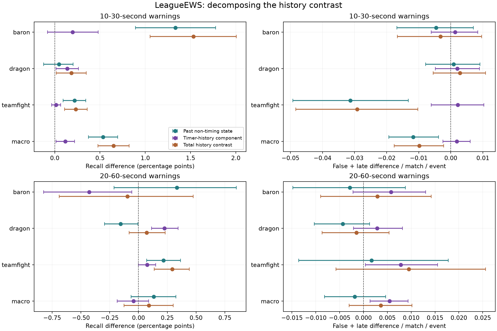

# Conditional history result: short-lead state history helps; regional gates still fail

**Result:** with genuine timer history and every current feature held available,
past non-timing state adds **+0.533 percentage points** of macro 10–30-second
recall [paired 95%: **+.374, +.696**], while aggregate false-plus-late burden falls
**.01168** warnings per match per event [−.01928, −.00384]. All three fixed seeds
and both regional macro intervals are positive. This strengthens the original
project's history explanation under this training recipe. It does **not**
establish architectural novelty, a shared-learning mechanism, or a breakthrough.
The longer-lead result is mixed and the regional warning-budget screen fails.

## Completed study and validity

Exactly three new LeagueEWS fits completed: 576 checkpointed shard updates per
seed, 1,728 total, 1,751,647 parameters each, 35.92 aggregate training minutes,
worker exit 0. There are now 42 completed neural fits across the continuation.
The original GPU study remains complete (12/12 fits; `summary.json` exists).
All checkpoints and original worktrees are preserved; no duplicate worker or
new environment installation was needed. The GPU was idle after completion.

The same League development archive supplies 24,000 training matches on patches
16.12–16.15 and 6,000 calibration matches on 16.16. The 3,000 early matches select
policies; the 3,000 later matches supply the estimates below, 1,500 per region.
Patch 16.17 remains sealed. All 216 early evaluation heads were jointly frozen
before any later policy replay; all 216 later heads completed. All 198 preceding
heads reproduced every prior policy count array exactly. The independent audit
passed 108,000 complete-match reference checks and 83,359 component checks, and
exactly reproduced 26,400 prior model and 26,400 shared-contrast metric records.

**Timing deviation:** the tested analysis and hash record were written 14:35 UTC,
before predictions 15:01 UTC, but Git approval delayed the commit until 16:37 UTC.
The planned commit-before-predictions order was therefore not met. The source
hashes are unchanged and no new prediction values or policy results had been
inspected when the discrepancy was recorded. [The full record](protocol-deviation.json)
retains the times. A [tested release-aware entry point](scoring-release-repair.md)
now prevents this failure in future runs; it does not retroactively repair this
study. The frozen training and analysis files remain unchanged.

## What the added control tests

The preceding study's full-minus-current and full-minus-timing-only contrasts
could not isolate past non-timing information. The new `clock_history` control
keeps true history in seven timing/count features and their missingness, plus
all current state. It repeats current values only across the past non-timing
channels. Ages, masks, sequence lengths, padding, initialization, optimizer,
targets and training budget remain fixed. See [protocol](protocol.md) and
[audit of mistakes and limits](audit.md).

The primary comparison is full timely LeagueEWS minus this control, averaged
equally across four fixed matched-early warning budgets. The paired identity is
**total history = conditional non-timing history + timer-history component**:
**+.650 = +.533 +.117 points**. This identity holds on the shared bootstrap draws;
interval endpoints must not be added. It is a representation comparison under
a fixed training recipe, not a causal decomposition of in-game actions.

## Short-lead findings

Primary 10–30-second means across the four budgets; recall is percentage points,
burden is false-plus-late warnings per match per event. Seed order is 20260930,
20261001, 20261002.

| Full minus timer-history control | Recall difference [95%] | Seed differences | Burden difference [95%] |
|---|---:|---|---:|
| Baron | +1.333 [.892, 1.777] | +1.900, +1.382, +.717 | −.00456 [−.01677, .00702] |
| Dragon | +.047 [−.122, .202] | +.019, +.080, +.043 | +.00086 [−.00785, .00912] |
| Teamfight | +.218 [.093, .344] | +.251, +.222, +.182 | −.03134 [−.04923, −.01323] |
| Macro | +.533 [.374, .696] | +.723, +.562, +.314 | −.01168 [−.01928, −.00384] |

Macro seed SD is .206 points. The recall evidence is strongest for Baron and
teamfights; Dragon's interval crosses zero. False warnings fall .02077
[−.02760,−.01362], but late warnings **increase** .00909 [.00617,.01214]. Thus the
burden improvement is not a reduction in both components. All four primary
budgets have positive macro recall intervals, positive seed differences and
negative aggregate burden intervals; the budget mean is not hiding a negative
operating point.

Europe macro recall rises +.555 [.295,.806], seed differences +.760,+.646,+.259;
Americas rises +.511 [.293,.720], seeds +.687,+.478,+.368. Their burden differences
are −.01066 [−.02087,.00022] and−.01270 [−.02348,−.00233]. Regional macro consistency
does not imply every regional event improves: Americas teamfight recall has an
interval crossing zero, and Dragon has one negative seed in each region.

The timer-history component is smaller: macro +.117 [.014,.219], seeds
+.018,+.184,+.149, burden +.00185 [−.00247,.00606]. Dragon contributes +.138
[.014,.263]. Baron and teamfight component intervals cross zero. Europe's macro
component is uncertain with a negative seed; Americas+.181 [.038,.320] comes
with more burden, +.00630 [.00011,.01307]. Timers are useful, but they do not
explain the full short-lead history contrast under this recipe.

The dense deterministic common policy at budget 1 also supports the conditional
history contrast: +.587 [.362,.804], all seeds positive; burden −.00800
[−.01959,.00337] is uncertain. The original coarse common grid gives −.046
[−.262,.165], with two negative seeds and much lower burden (−.08148).
Its Dragon contrast is−1.630 [−1.911,−1.377], with−.14278 burden. That negative
result remains recorded; disparate later operating costs prevent treating it
as an equal-cost contradiction or selecting whichever policy looks best.

## Longer lead and warning-budget failures

At 20–60 seconds, conditional non-timing history has macro +.132 [−.064,.324]:
all seed points positive, but no clear aggregate improvement. Baron +.333
[−.212,.850] is uncertain; teamfights +.218 [.070,.365] improve; **Dragon declines
−.154 [−.295,−.006]**, including Americas −.300 [−.501,−.095] with all three seeds
negative. The timer component has macro −.043 [−.185,.088], Baron −.429
[−.823,−.058], Dragon +.225 [.114,.344], and additional burden +.00549
[.00140,.00934]. History components are event- and lead-dependent.

| Budget 1 policy / lead window | Full input hard-one failures | Timer-history control failures |
|---|---:|---:|
| Matched-early / 10–30 | 12/18 | 12/18 |
| Dense common / 10–30 | 5/18 | 4/18 |
| Matched-early / 20–60 | 7/18 | 7/18 |
| Dense common / 20–60 | 0/18 | 3/18 |

The new control's primary mixture burden reaches 1.0672, with Americas Baron
and Dragon over 1 for every seed, plus five Europe Dragon/teamfight cells and
one Americas teamfight cell. Lower budgets have no hard-one overrun for this
control, but may exceed their own smaller nominal budget. Their already
inspected results cannot be promoted as fresh confirmation. All four descriptive
conditional-history rules pass; **practical promotion remains unsupported**.

## Original four-family comparison preserved

Original registered coarse common budget 1, 10–30 seconds. Each cell is
**recall percent / burden**, averaging the original three seeds.

| Family | Baron | Dragon | Teamfight | Macro |
|---|---:|---:|---:|---:|
| leagueews | 20.878 / 0.9479 | 13.176 / 0.8887 | 3.082 / 0.7578 | 12.379 / 0.8648 |
| gru | 12.085 / 0.8510 | 8.977 / 0.8220 | 2.204 / 0.6806 | 7.755 / 0.7845 |
| tcn | 20.734 / 0.9658 | 13.532 / 0.8991 | 2.834 / 0.7260 | 12.367 / 0.8636 |
| snapshot | 18.636 / 0.9471 | 11.743 / 0.8264 | 2.590 / 0.7601 | 10.990 / 0.8446 |

The registered LeagueEWS−GRU macro difference remains +4.623 [4.223,5.064]points,
seeds+4.932,+3.379,+5.559, with failed regional budgets. LeagueEWS−TCN remains
+.012 [−.156,.178], with two negative seeds; LeagueEWS−snapshot is +1.389
[1.135,1.637], all seeds positive. The original 60-second LeagueEWS−GRU macro
result is adverse (−.843points), including a large Dragon loss. The corrected
target studies, alternative policies and new mechanism contrasts do not replace
that registered comparison. [Tables](tables.md) retain both lead windows and
all original/derived families; machine-readable results retain every region
and seed.

## Interpretation and reproducibility

The missing intermediate input control is now resolved: additional past
non-timing state supports short-lead Baron and teamfight warnings beyond real
timer history and current features. This is narrower than proving temporal
order, attention design or shared-task learning. Input removal also changes
effective capacity and optimization; missingness trajectories are included.
The prior large longer-lead target gain already occurred with current-only
input, so it cannot be attributed wholesale to better history learning.
Aligned-target task sharing and robust regional budget control remain unresolved.
The [literature check](../timely-inputs-2026-10-04/literature-check.md) supplies no
basis for claiming method novelty from these metric changes.

Intervals use 2,000 paired whole-match bootstrap draws stratified by region,
with all models, events, budgets and seeds sharing the same match draws. Seeds,
rows and repeated budgets are **not** independent matches. Intervals are
pointwise, unadjusted and conditional on models and selected policies; they omit
refitting, adaptive-search and realized random-policy variance. Shared-player
match dependence is not identifiable from this archive. Reusing inspected
calibration data is not fresh generalization evidence. Baron/Dragon labels are
objective completions, not engagement onset.

[Reproduction instructions](reproduce.md), [execution hashes](execution-record.json),
[plan](plan.json), [early freeze gate](evaluation-gate.json), [full tables](tables.md),
aggregate CSV files and `analysis.json` preserve positive and negative findings.
The full suite passes 642 tests, one skipped, 85.89% coverage; Ruff passes and mypy
passes 87 source files. Private matches, score arrays and model binaries remain
excluded from publication. No new training is running and patch 16.17 remains sealed.

