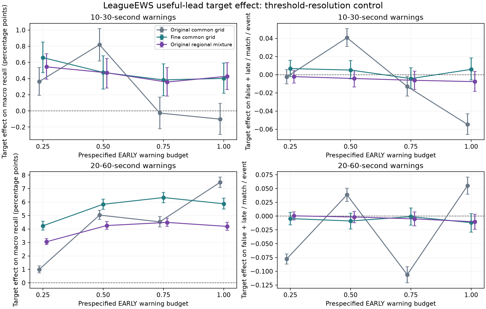

# Finer deterministic thresholds recover the target gain, with unresolved warning costs

Completed 4 October 2026. The focused follow-up selected all 72 early heads,
froze them together, then evaluated all 72 later heads. **No new model was fit.**
It reused the completed cumulative/timely LeagueEWS and TCN models, three seeds
each. All 33 neural fits and checkpoints across previous studies remain intact.
The original GPU study's summary exists; the new GPU study and both policy
evaluations are complete. No training worker remains active. Patch 16.17 is sealed.

The useful-lead target gain **does not require a randomized threshold mixture**.
With the frozen finer common deterministic grid, LeagueEWS's primary target
effect is **+0.402 percentage points [0.217, 0.590]**, positive in all three seeds.
The original coarse grid gave −0.101 [−0.291, 0.094] at the same early budget one.
The finer-grid result supports objective alignment while exposing another
evaluation limitation. **It does not establish equal warning cost, regional
budget compliance or a breakthrough.**

## What this follow-up fixes

The [preceding six-fit study](../timely-neural-2026-10-03/research-report.md)
corrected an omitted neural target control: cumulative positives included events
too close to count as timely. Its positive matched-early result conflicted with
its coarse deterministic budget-one result. The regional deterministic control
did not resolve that discrepancy. Attributing it to an intrinsic need for
randomization would have been premature.

The [protocol](protocol.md) and [plan](plan.json) freeze a tenfold refinement:
silence plus 1,001 numeric thresholds, retaining all original 101 numeric values
bit-for-bit and adding nine log-spaced points between each adjacent pair.
The same hit-maximization objective, regional budget constraints and
cost/high-threshold tie rule select common and regional deterministic policies.
Inputs, predictions, cooldown, event definitions, matches and seeds are fixed.
The protocol and analysis were committed before execution; all 72 early heads
were frozen before any later evaluation. No favorable budget, seed or stopping
epoch was selected after results.

The estimand changes from the earlier four-budget mixture diagnostic to the
explicitly registered dense-common budget-one target contrast. Both are saved;
their numerical magnitudes should not be interchanged. The original registered
LeagueEWS−GRU comparison remains +4.623 points with its failed regional gate,
as documented in the preceding report. It has not been replaced.

## Main result and seed consistency

All intervals below are conditional paired whole-match 95% intervals. Burden
means false-plus-late warnings per match per event.

| Lead | Dense-common budget-one contrast | Macro recall difference, pp [95%] | Burden difference [95%] | Seed recall differences, pp |
|---|---|---:|---:|---|
| 10–30 s | Timely LeagueEWS − original | +.402 [.217, .590] | +.00585 [−.00570, .01856] | +.492, +.422, +.293 |
| 10–30 s | Timely TCN − original | +.254 [.075, .429] | −.00163 [−.01308, .01059] | +.198, +.213, +.350 |
| 10–30 s | Timely LeagueEWS − timely TCN | +.174 [.009, .343] | −.00441 [−.01282, .00363] | +.260, +.308, −.046 |
| 20–60 s | Timely LeagueEWS − original | +5.873 [5.479, 6.293] | −.01189 [−.02904, .00456] | +6.362, +5.769, +5.487 |
| 20–60 s | Timely TCN − original | +5.380 [5.023, 5.768] | +.00248 [−.01367, .01745] | +5.162, +5.575, +5.403 |
| 20–60 s | Timely LeagueEWS − timely TCN | +.654 [.407, .895] | −.01056 [−.01904, −.00189] | +.960, +.356, +.646 |

The primary LeagueEWS target-effect seed SD is .101 points; the secondary SD is
.446. Every seed improves at each of the four dense-common primary budgets.
Budget-mean target effects are +.480 [.337, .619] primary and +5.569
[5.272, 5.881] secondary. The dense regional budget-one primary gain is +.319
[.130, .505], also positive in all three seeds. These sensitivity results retain
the same match pairing; policies and budgets are not extra replications.

Primary dense-common operating points, recall percent / burden:

| Model | Baron | Dragon | Teamfight | Macro |
|---|---:|---:|---:|---:|
| Original LeagueEWS | 21.207 / .9828 | 14.632 / .9963 | 3.563 / .9144 | 13.134 / .9645 |
| Original TCN | 21.043 / 1.0047 | 14.720 / .9948 | 3.563 / .9298 | 13.109 / .9764 |
| Timely LeagueEWS | 21.238 / .9839 | 15.456 / .9746 | 3.915 / .9527 | 13.536 / .9704 |
| Timely TCN | 21.177 / .9979 | 15.109 / .9740 | 3.802 / .9524 | 13.363 / .9748 |

## Event and regional failures

| Event | LeagueEWS primary target effect, pp [95%] | Primary burden difference [95%] | Secondary recall difference, pp [95%] |
|---|---:|---:|---:|
| Baron | +.031 [−.303, .391] | +.00111 [−.01056, .01300] | +2.376 [1.623, 3.159] |
| Dragon | +.824 [.426, 1.220] | −.02178 [−.04144, −.00133] | +13.311 [12.492, 14.169] |
| Teamfight | +.352 [.178, .523] | +.03822 [.01356, .06489] | +1.932 [1.602, 2.288] |

Primary Baron still has two negative seed differences and no reliable benefit.
The non-harm point-estimate gate now passes, but this is not an event-wise
noninferiority demonstration. Teamfight's primary recall gain accompanies a
clear increase in warning burden. Dragon improves with lower mean burden under
this policy. Macro uncertainty crossing zero does not establish equal cost.

Primary target gains hold in Europe +.496 [.251, .762] and the Americas +.312
[.031, .581], with all three seeds positive in both. Secondary gains are +5.281
[4.729, 5.821] and +6.453 [5.942, 7.040]. Nevertheless, **5/18 timely LeagueEWS**
and **3/18 timely TCN** primary region/event/seed cells at budget one exceed one
later false-plus-late warning per match. All three Americas Baron seeds fail in
each family; maxima are 1.0573 and 1.0487. LeagueEWS also fails Europe Dragon
seed 20261001 (1.0007) and Americas teamfight seed 20260930 (1.0120).
No new hard-one overrun occurs at the three lower primary budget points.

Thus the frozen primary-gain and mean-event gates pass; no-extra-burden and
regional-budget gates fail. This follow-up does not retrospectively pass any
earlier promotion screen. Every nominal-budget and hard-one failure is in
[budget-violations.csv](budget-violations.csv).

## Interpretation and remaining gaps

The primary change in target effect from coarse to fine common thresholds is
+.504 [.404, .609] points. Its warning-burden contrast also shifts by +.06063
[.05430, .06715] warnings/match/event: the coarse rule had compared the timely
model at substantially lower cost. The target-by-grid interaction has one
negative seed. A finer grid recovers an aggregate deterministic signal; it is
not proof that the entire mixture effect is a numerical artifact or that the
result holds at exactly equal later cost.

Both architectures benefit strongly from useful-lead supervision. Under the new
primary policy, their target-effect difference is +.148 [−.040, .344] points,
with one negative seed. The timely LeagueEWS−TCN primary advantage also has one
negative seed. The larger secondary advantage is encouraging development
evidence, but parameter counts and compute remain unequal. None of these
comparisons identifies architectural novelty or a task-sharing mechanism.

The original history and sharing ablations used cumulative supervision. Their
conclusions cannot simply be transferred to the corrected target. A matched
timely-target history-removal control, a timing-only control and calibrated
regional budget headroom remain substantive gaps. Current features already
contain historical summaries. The roughly one-third real-frame opportunity
ceiling for primary warnings remains, while teamfight recall is still far below
it. Low recall cannot be explained away by cadence alone.

This continuation has completed the missing neural target control and the
focused threshold-resolution experiment selected from its results. It found
measurable improvements and retained their failures. More adaptive searches on
these same calibration matches cannot turn them into fresh confirmation; no
unseen-patch claim is possible while the stipulated test remains sealed.

## Evidence and reproducibility

All original threshold counts reproduce on early calibration. The later analysis
reproduces all **5,760** previously published model metric/interval records for
these four families and three old policies. New policies pass **310,999**
independent threshold/match reference checks, covering both budget-one policies
on every later match plus sampled checks of all other selected thresholds.
The complete suite passes 619 tests, one skipped, 85.89% coverage; Ruff and mypy
pass. No experiment worker failed or needed checkpoint repair.

The analysis uses 2,000 region-stratified whole-match bootstrap draws shared
across all models, seeds, policies and budgets. Seed means describe fixed fits,
not extra independent matches. Intervals are pointwise and conditional on models
and early selections; they exclude training, selection, adaptive-search and
randomization-realization uncertainty. All matches are from previously inspected
League development data. [Reproduction](reproduce.md), [execution record](execution-record.json),
[full tables](tables.md), [paired analysis](analysis.json), [aggregate counts](aggregate-counts.csv)
and [seed results](by-seed.csv) are public; private matches, predictions and
model binaries are excluded.

