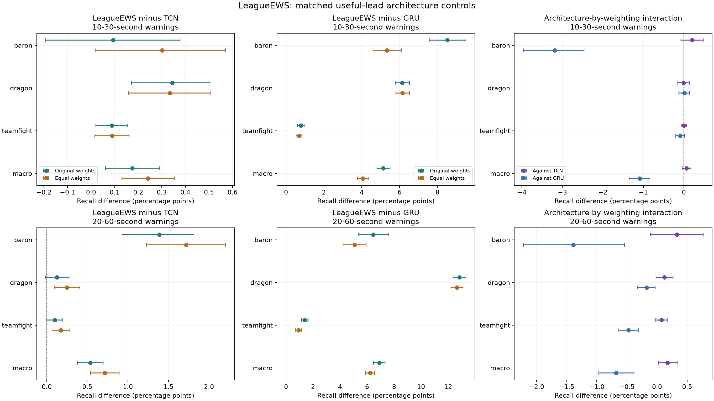
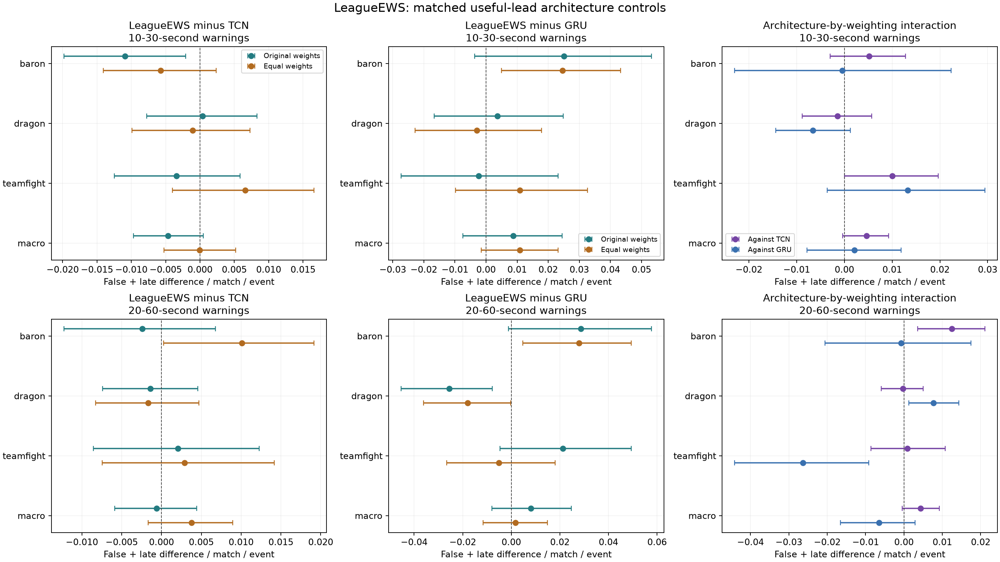

# Matched useful-lead architecture controls

**Complete; exploratory development only.** Equal-weight LeagueEWS retains a
modest primary recall advantage over equal-weight TCN: **+0.242 percentage
points [0.131, 0.354]**, positive in all three seeds. All three aggregate event
intervals are positive. The regional-consistency and no-extra-burden rules
fail, however, and regional warning budgets still overrun. This is evidence
for a limited architecture comparison under the fixed recipe, not a breakthrough.

The nine new fits completed on 6 October 2026; this report was prepared on
7 October. Training, scoring, all 342 policy heads, paired analysis and
independent replay are complete. Preserve all **69 completed neural fits**.
Patch 16.17 remains sealed. No completed worker needs restarting.

## Question and controls

The preceding [optimizer factorial](../timely-optimization-2026-10-05/research-report.md)
improved LeagueEWS by changing event weights. Comparing that model against the
original-weight TCN confounded architecture with weighting. This
[committed protocol](protocol.md) added equal-weight TCN, original-weight GRU
and equal-weight GRU, each with seeds 20260930, 20261001 and 20261002. Existing
original/equal-weight LeagueEWS and original-weight useful-lead TCN were reused.
No new architecture or optimization algorithm was introduced.

All cells share genuine observations, normalization, useful-lead evaluated
targets, cumulative auxiliary heads, AdamW, twelve epochs and the original
within-architecture initialization and batch/RNG streams. Original event
weights are (1, 2, 2.5); equal weights are (11/6, 11/6, 11/6). PCGrad is absent
from these new cells. Baron and Dragon targets are objective completions;
teamfight retains its registered kill-episode definition.

Architecture size and computation are **not matched**:

| Architecture | Parameters | Measured new training minutes per seed |
|---|---:|---:|
| LeagueEWS | 1,751,647 | No new fit; equal-weight controls reused from the preceding study |
| TCN, equal weights | 557,087 | 5.39, 5.38, 5.33 |
| GRU, original weights | 912,717 | 6.64, 6.73, 6.66 |
| GRU, equal weights | 912,717 | 6.60, 6.64, 6.62 |

The nine fits used 5,184 shard updates and 56.00 aggregate training minutes.
These are recorded training times on the RTX 4060 Laptop GPU, not controlled
inference benchmarks. The comparison does not isolate a specific hybrid layer
or establish equally tuned or capacity-matched baselines.

## Primary result and its limits

The primary endpoint is equal-weight LeagueEWS minus equal-weight TCN macro
10–30-second recall, averaged equally across four fixed matched-early budgets
(0.25, 0.5, 0.75, 1.0 false-plus-late warnings per match per event). These are
four operating points, not four independent samples. Policies were selected
on 3,000 early calibration matches and frozen before replay on 3,000 later
calibration matches. The latter have been inspected repeatedly in this research.

All intervals below are pointwise conditional 95% intervals from the same
2,000 paired whole-match bootstrap draws, stratified by region. They condition
on fitted models and selected policies and omit training, model selection and
adaptive research-search uncertainty. They are not fresh confirmation.

| Endpoint | Recall difference, percentage points [95%] | Seed differences |
|---|---:|---|
| Primary macro, 10–30 s | +0.2420 [0.1305, 0.3543] | +0.1995, +0.2670, +0.2594 |
| Baron, 10–30 s | +0.3022 [0.0178, 0.5702] | +0.3681, +0.3575, +0.1810 |
| Dragon, 10–30 s | +0.3343 [0.1593, 0.5082] | +0.1542, +0.3706, +0.4780 |
| Teamfight, 10–30 s | +0.0894 [0.0157, 0.1618] | +0.0761, +0.0730, +0.1191 |
| Macro, 20–60 s | +0.7140 [0.5401, 0.8921] | +0.8410, +0.7199, +0.5811 |
| Baron, 20–60 s | +1.7198 [1.2300, 2.2030] | +1.9590, +1.5170, +1.6833 |
| Dragon, 20–60 s | +0.2478 [0.0955, 0.4069] | +0.3594, +0.5007, −0.1169 |
| Teamfight, 20–60 s | +0.1744 [0.0655, 0.2842] | +0.2045, +0.1420, +0.1768 |

Absolute primary macro recall is 10.210% for LeagueEWS and 9.968% for TCN.
At 20–60 seconds it is 15.890% and 15.176%. Teamfight recall remains low
(2.660% versus 2.571% at short lead); the aggregate gain does not make the
system broadly effective at anticipating all three events.

Short-lead macro burden differs by approximately −0.0001 [−0.0053, 0.0052]
warnings per match per event. Its upper bound is above zero, so the fixed
no-extra-burden rule fails. An interval spanning zero proves neither equality
nor an increase. Longer-lead burden differs by +0.0038 [−0.0017, 0.0090], and
Baron's longer-lead burden increases by +0.0101 [0.0003, 0.0192].

Europe's primary macro effect is +0.1344 [−0.0263, 0.2876], while the Americas
effect is +0.3489 [0.1881, 0.5009]. All regional macro seed effects are positive,
but Europe's interval crosses zero. Its Baron and teamfight intervals also
cross zero, with one adverse seed each. Thus the regional-consistency rule
fails. Both longer-lead regional macro intervals are positive; Europe also
adds macro burden (+0.0115 [0.0040, 0.0194]). Longer-lead Dragon loses in the
third seed in both regions.

## Weighting and GRU controls

Equal weights also improve TCN: +0.2586 [0.1692, 0.3440] short-lead macro
points and +0.2660 [0.1413, 0.3951] at longer lead, positive in all seeds.
Consequently the earlier +0.5005-point comparison between equal-weight
LeagueEWS and original-weight TCN overstates the matched-weight difference.
The short-lead architecture-by-weighting interaction is +0.0663
[−0.0412, 0.1741], with one negative seed. It does not clearly establish a
LeagueEWS-specific response to equal weighting. The longer-lead interaction
is +0.1765 [0.0207, 0.3379], positive in every seed, with an adverse Baron
burden interaction (+0.0125 [0.0036, 0.0211]). Both interactions are calculated
inside each paired bootstrap draw.

Equal-weight LeagueEWS exceeds equal-weight GRU by +4.0551 [3.7861, 4.3436]
short-lead macro points and +6.2193 [5.8808, 6.5671] at longer lead. Every
aggregate event interval and all associated seed effects are positive. This
satisfies the separate GRU support rule but cannot replace the TCN primary.
Baron gains accompany higher Baron burden in both windows.

The GRU control is sensitive to the recipe. Replacing cumulative targets with
useful-lead targets under original weights **reduces** its macro recall by
1.3154 points [1.1854, 1.4414] at short lead and 2.2737 [2.0622, 2.4730] at
longer lead, adverse in all seeds. Equal weights recover +1.4166
[1.1845, 1.6611] and +1.1221 [0.8667, 1.3756] relative to original-weight
useful-lead GRU. Equal weighting therefore narrows the LeagueEWS–GRU gap:
the paired interactions are −1.0918 [−1.3524, −0.8394] and −0.6797
[−0.9675, −0.3821], negative in every seed. A large margin against this fixed
GRU recipe is not evidence against all recurrent models or optimized GRUs.

The strong independent-encoder control still matters: equal-weight LeagueEWS
trails it by 0.8699 Baron recall points [0.2132, 1.5138] at longer lead and
adds Baron burden. That earlier result reproduced exactly. The current
architecture comparison does not solve negative task transfer.

## Policy sensitivity and practical failures

The primary advantage is positive at all four matched-early budgets, with all
seed effects positive. It also survives the fine common grid: short-lead mean
+0.2787 [0.1653, 0.3967] and longer-lead mean +0.7932 [0.6181, 0.9871]. The
latter adds burden (+0.0075 [0.0020, 0.0126]). The coarse common grid is less
stable: short-lead mean +0.1126 [−0.0040, 0.2261], with one negative seed;
at budget one its recall difference is −0.5346 [−0.7129, −0.3640], with
substantially lower burden. These differently attained costs cannot establish
a general ranking independent of operating policy.

Hard-one violations below count event/region/seed/budget cells out of 72.
The complete nominal-budget and hard-one failures are in
[budget-violations.csv](budget-violations.csv); neither the mean budget nor
average burden excuses a failed cell.

| Model | Matched 10–30 s | Matched 20–60 s | Fine common 10–30 s | Fine common 20–60 s |
|---|---:|---:|---:|---:|
| Equal LeagueEWS | 12 | 8 | 4 | 3 |
| Equal TCN | 11 | 7 | 5 | 3 |
| Original useful-lead GRU | 9 | 8 | 4 | 1 |
| Equal useful-lead GRU | 9 | 10 | 3 | 2 |

The frozen descriptive rules produce three passes (architecture support,
event point non-harm, secondary GRU support) and two failures
(no-extra-burden, regional architecture consistency). Event point non-harm
is not an event-wise noninferiority test. Previously failed regional gates
remain failed; no later policy choice retroactively changes their result.

## Audit and reproducibility

Training protocol commit `f45933a` preceded fitting; analysis commit
`f5e2be605bfd46a16dc0799c9e26236840a54c0a` preceded the scoring release at
2026-10-06 17:07:20 UTC. The first score artifact followed at 17:07:32 UTC.
All nine fits were complete with zero scores before release. All 342 early
heads were frozen with zero later heads before later replay. Checkpoint hashes
were unchanged by scoring. Local timestamps establish local ordering, not an
external preregistration.

The [execution record](execution-record.json) verifies 324,000 new full
reference checks, 130,448 component checks, exact reproduction of all 288
previous heads under all five policies, and exact reproduction of 38,400 prior
model plus 67,200 prior contrast metric records. The [quality gate](quality-gate.json)
records 704 passed tests, one skipped, 85.86% coverage, Ruff, mypy on 87 source
files and the secret check. Software checks do not establish empirical validity.

See [tables.md](tables.md) for all prespecified contrasts and policy/region
views, [analysis.json](analysis.json) for complete intervals and rules,
[by-seed.csv](by-seed.csv) and [aggregate-counts.csv](aggregate-counts.csv) for
aggregate exports, and [reproduce.md](reproduce.md) for execution details.
The publication manifest binds the losslessly formatted output bytes; raw
analysis hashes remain in the execution record.

## Consequence for continuation

Matching loss weights closes one specific confound and leaves a modest
LeagueEWS advantage over this TCN recipe. It supplies neither method novelty
nor a practical release. Further architecture search alone would not address
the recurring warning-budget failures. The next investigation should test
the warning policy's transfer from early to later matches, with a fixed
causal policy, explicit uncertainty margins and all event/region outcomes.
That work must preserve these failures, account for already inspected
calibration and retain a separate fresh confirmation requirement. The sealed
test remains untouched.
