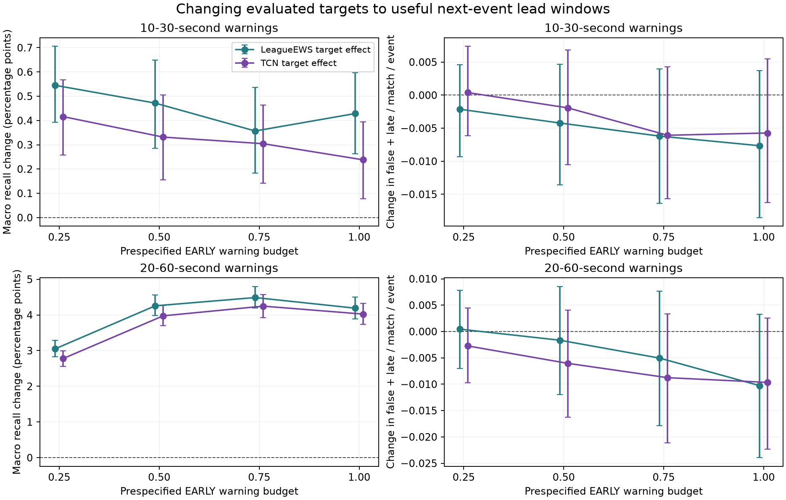
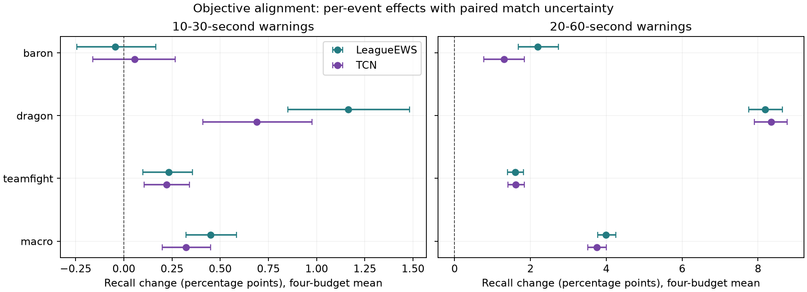

# Useful-lead supervision improves recall; the practical screen still fails

Completed 4 October 2026. Six new CUDA fits, 3,456 shard updates and all 162
gated policy heads finished successfully. There are now 33 completed neural
fits across the preserved studies. The original twelve-fit
`league-ews-gpu/data/private/compact-notebook-v1/summary.json` exists and remains
unchanged. No training worker is running. Patch 16.17 remains sealed.

The corrected experimental omission produces a reproducible development gain:
changing only the evaluated training targets to the next event's useful lead
window improves LeagueEWS's primary macro recall by **0.451 percentage points
[0.324, 0.584]**. All three seeds improve. The secondary gain is **3.996 points
[3.770, 4.248]**, chiefly Dragon. TCN also benefits, so much of the improvement
comes from supervision rather than the hybrid architecture. **The frozen
practical promotion screen fails. This is an engineering finding, not a
breakthrough, novelty claim or future-patch result.**

## What was corrected

The [audit](audit.md) records the mistakes and remaining gaps. Earlier tree work
had already recommended useful-lead targets; moving on to sharing and PCGrad
without this neural control was an experimental omission. About 32–35% of the
original positive training labels reward events too close to count as timely.
The original studies remain valid measurements of their fixed cumulative-target
recipe. Their results and checkpoints were preserved.

Six fits cross the original three seeds with LeagueEWS and TCN. Only the evaluated
30/60-second target columns change to next-event delays in [10,30]/[20,60]
seconds. The 10/20-second cumulative auxiliaries, architecture, features, masks,
normalizer, initialization, optimizer, twelve epochs and shuffles are fixed.
Exact next-event semantics matter: a closer late event prevents a later event
from rescuing an alert. Independent replay tests verify this boundary.

The [protocol](protocol.md) and [plan](plan.json) precede training. Evaluation and
analysis were committed before new calibration predictions; all 162 early
heads were jointly frozen before any later policy evaluation. Training uses
24,000 development matches; threshold selection and evaluation use disjoint
chronological 3,000-match halves of patch-16.16 calibration, with 1,500 matches
per region in each half. These matches have informed earlier experiments, so
every new inference is exploratory.

## Preserve the registered comparison

The original common deterministic rule, early budget one, reproduces exactly.
Cells are mean timely recall percent / false-plus-late warnings per match.

| Original family | Baron | Dragon | Teamfight | Macro |
|---|---:|---:|---:|---:|
| LeagueEWS | 20.878 / .9479 | 13.176 / .8887 | 3.082 / .7578 | 12.379 / .8648 |
| GRU | 12.085 / .8510 | 8.977 / .8220 | 2.204 / .6806 | 7.755 / .7845 |
| TCN | 20.734 / .9658 | 13.532 / .8991 | 2.834 / .7260 | 12.367 / .8636 |
| Snapshot | 18.636 / .9471 | 11.743 / .8264 | 2.590 / .7601 | 10.990 / .8446 |

LeagueEWS−GRU remains **+4.623 points [4.223, 5.064]**, with seed differences
+4.932, +3.379 and +5.559. Its regional budget gate still fails. LeagueEWS−TCN
remains +0.012 [−0.156, 0.178]; LeagueEWS−snapshot is +1.389 [1.135, 1.637].
The secondary LeagueEWS−GRU result remains negative. Neither the new target nor
the new policy diagnostic replaces this registered primary comparison.

## Target effects at matched early warning budgets

The new primary averages four prespecified early budgets (.25, .5, .75, 1),
using region-specific mixtures of whole-match thresholds. This is expected
policy performance: no within-match threshold switching or sampled coin flips.
Equal early burden does not mean equal later burden.

| Useful lead | Contrast | Macro recall difference, pp [95%] | Burden difference [95%] | Recall differences by seed, pp |
|---|---|---:|---:|---|
| 10–30 s | Timely LeagueEWS − original | +0.451 [0.324, 0.584] | −.00505 [−.01317, .00336] | +.541, +.446, +.365 |
| 10–30 s | Timely TCN − original | +0.322 [0.199, 0.451] | −.00333 [−.01087, .00493] | +.273, +.325, +.369 |
| 10–30 s | Timely LeagueEWS − timely TCN | +0.176 [0.061, 0.290] | −.00467 [−.00969, .00049] | +.278, +.198, +.051 |
| 20–60 s | Timely LeagueEWS − original | +3.996 [3.770, 4.248] | −.00413 [−.01437, .00586] | +4.213, +3.897, +3.877 |
| 20–60 s | Timely TCN − original | +3.756 [3.514, 4.005] | −.00680 [−.01663, .00260] | +3.577, +3.918, +3.773 |
| 20–60 s | Timely LeagueEWS − timely TCN | +0.538 [0.379, 0.694] | −.00059 [−.00590, .00443] | +.703, +.425, +.485 |

Timely LeagueEWS's budget-mean primary recalls are Baron 16.276%, Dragon 10.723%
and teamfight 2.656%; burdens .6380, .6357 and .6052. These averages use lower
budgets than the preceding registered table and should not be compared as one
operating point. All nine variants and all seed values are in [tables](tables.md)
and [by-seed.csv](by-seed.csv).

| Event | LeagueEWS target effect, primary pp [95%] | Secondary pp [95%] |
|---|---:|---:|
| Baron | −0.044 [−0.243, 0.167] | +2.196 [1.677, 2.736] |
| Dragon | +1.163 [0.852, 1.483] | +8.187 [7.751, 8.640] |
| Teamfight | +0.233 [0.099, 0.357] | +1.604 [1.392, 1.814] |

Dragon and teamfight improve in every seed at both lead windows. Primary Baron
changes +.203, −.209, −.127 points: no demonstrated benefit or reliable harm.
Macro seed SD is .088 points for the primary target effect and .188 for the
secondary. Changing the target shifts error types: primary macro late warnings
fall .04397/match/event while false warnings rise .03893; secondary late warnings
fall .12109 while false warnings rise .11696. The small net burden change must
not hide that tradeoff.

## Regional and policy failures

Primary target gains hold in both regions: Europe +.476 [.293, .673] points,
Americas +.426 [.242, .609], all three seeds positive in each. Secondary gains
are +3.864 [3.525, 4.194] and +4.122 [3.762, 4.491]. Primary Baron is uncertain
in both regions, with the Americas mean negative. Timely LeagueEWS's overall
advantage over timely TCN is not positive in every regional seed: Europe's last
primary seed is slightly negative.

At early budget one, **12/18 timely LeagueEWS** and **9/18 timely TCN** primary
region/event/seed cells exceed one later false-plus-late warning per match.
The largest are Americas Baron: 1.0631 and 1.0604. No primary matched-early cell
in either new family exceeds the hard-one limit at budgets .25/.5/.75; nominal
budget drift still occurs. These lower points do not retrospectively rescue
the frozen all-budget gate. Every failure is saved in [budget-violations.csv](budget-violations.csv).

The primary target gain is also policy dependent. At the **original deterministic
budget-one rule**, timely LeagueEWS−original is **−.101 [−.291, .094] points**,
with two negative seeds, while burden is lower. At four-budget means the common
and regional deterministic gains are +.263 and +.235 points, each with one
negative seed. The matched-early target gain is positive at all four budgets
and in every seed. A finer deterministic threshold control is still missing;
the results do not establish that the mixture's advantage requires randomization.

Adding region-specific deterministic thresholds to the original LeagueEWS
increases primary budget-mean recall by .153 points and burden by .01642.
Moving from that policy to the mixture adds .886 points and .10744 burden.
Thus regional selection is only part of the policy effect; mixture interpolation
also spends more of the early budget. This is not a decomposition into pure
randomization benefit versus cost matching.

The frozen objective-effect and strong-control gates pass. Event non-harm,
no-extra-burden and regional-budget gates fail; practical promotion is false.
The no-extra-burden failure reflects uncertainty crossing zero, not evidence
that average burden increased. The event gate fails on Baron's negative point
estimate, not a significant harmful effect.

## What explains the gain, and what remains missing

The controlled intervention supports **objective alignment in both architectures**.
LeagueEWS's primary target effect exceeds TCN's by .128 [.018, .241] points,
but one seed of that interaction is negative. The secondary difference of target
effects is .240 [.064, .430], also with one negative seed. These are small,
conditional, exploratory interactions, not hybrid novelty.

Earlier history removal reduced primary matched-early recall by .717 points,
mostly Baron, under cumulative supervision. Task sharing mixed Dragon benefits
with Baron costs; PCGrad's advantage did not survive the efficiency comparison.
**History and sharing have not been re-ablated under useful-lead supervision.**
Parameter/compute matching and a timing-only control are also missing. Current
features already contain clocks, objective counts and time-since summaries.
The present results cannot identify a new representation mechanism, which past
signals matter, or whether task sharing causes the target gain.

The next focused question is whether **coarse threshold resolution hides the
target gain under deterministic policies**. Test a frozen finer grid with the
same stored scores, common/regional selection rules, early-only selection and
paired later evaluation. No refitting, test release, post-result margin change
or search for a favorable seed is justified. Better budget calibration remains
a separate requirement for deployment.

## Evidence quality and reproduction

All 126 old heads reproduce their saved per-match counts across both previous
policies and all budgets. All 6,720 old model metric/interval records reproduce
exactly. New heads pass 108,000 independent full-match replay checks, plus
33,170 component-threshold checks across all heads. The full suite passes 615
tests (one skipped), with 85.89% coverage; mypy passes 87 files.

Uncertainty uses 2,000 paired whole-match bootstrap draws, stratified by region,
shared across models, policies, budgets and fixed-seed averages. Rows, repeated
seeds and budgets are not independent matches. Pointwise intervals condition
on fitted models and selected policies; they omit refitting, policy selection,
adaptive-search and realized randomization uncertainty. Repeated calibration
work cannot supply fresh confirmation. [Reproduction](reproduce.md),
[execution record](execution-record.json), [analysis](analysis.json),
[aggregate counts](aggregate-counts.csv) and source figures preserve the evidence;
private arrays and model binaries are excluded.

