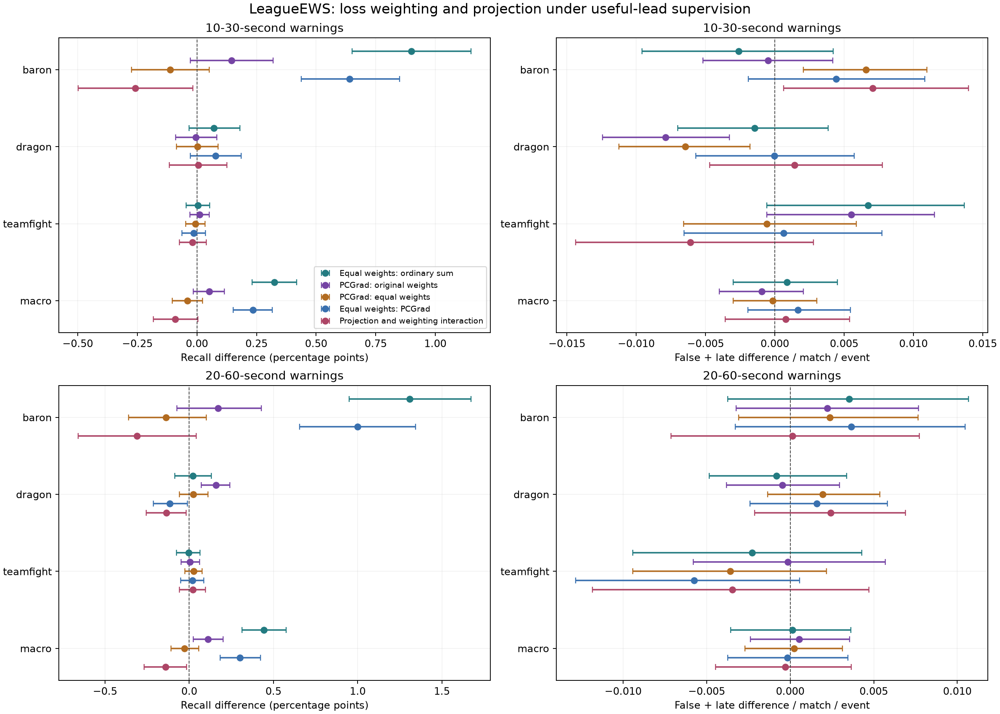

# Equal event weights recover warning recall; PCGrad adds no clear primary gain

**Completed, 6 October 2026.** Equal weights improve useful-lead LeagueEWS macro
recall by **0.325 percentage points [conditional paired 95%: 0.231, 0.418]** at
10–30 seconds, with every seed and both regional macro intervals positive.
Baron accounts for most of the gain. Its longer-lead recall improves by
**1.310 points [0.950, 1.672]**, partially mitigating the earlier sharing deficit.
PCGrad does not establish an additional primary advantage at either weight setting.

Four of five prespecified diagnostic rules pass: weighting support, primary
event point non-harm, regional consistency and longer-lead Baron recovery.
The no-extra-burden rule fails, regional warning-budget failures remain, and
longer-lead Baron still trails independent encoders. These results support
a loss-weighting effect in the fixed LeagueEWS recipe, not a novel optimizer,
uniform event benefit, deployment promotion or breakthrough.

All nine new fits, 288 policy heads and the aggregate audit are complete.
The continuation now contains **60 completed neural fits**. Patch 16.17 remains sealed.

## Primary comparison: equal weights under ordinary summed gradients

The primary endpoint averages recall equally over four fixed matched-early
budgets, with 10–30 seconds of lead. Original event weights are (1, 2, 2.5);
equal weights are (11/6, 11/6, 11/6), retaining total loss weight 5.5. Differences
below are equal minus original. Seed order is 20260930, 20261001, 20261002.
Burden is false-plus-late warnings per match per event.

| Event | Recall difference, points [95%] | Recall differences by seed | Burden difference [95%] |
|---|---:|---|---:|
| Baron | +0.899 [0.650, 1.149] | +0.690, +1.044, +0.962 | −0.00262 [−0.00957, +0.00422] |
| Dragon | +0.072 [−0.032, +0.180] | +0.001, +0.020, +0.195 | −0.00146 [−0.00699, +0.00386] |
| Teamfight | +0.004 [−0.045, +0.054] | −0.090, +0.075, +0.026 | +0.00673 [−0.00057, +0.01367] |
| Macro | +0.325 [0.231, 0.418] | +0.200, +0.380, +0.394 | +0.00088 [−0.00299, +0.00452] |

Mean macro recall rises from 9.885% to 10.210%; mean burden changes from 0.6263
to 0.6271. The uncertain burden difference fails the prespecified upper-bound
rule; it does not establish that total burden increased. Warning composition
changes: macro late warnings increase 0.00508 [0.00370, 0.00658], while false
warnings decline 0.00420 [0.00085, 0.00768].

Regional macro effects are positive in every seed: Europe +0.304 [0.167, 0.433]
points and Americas +0.347 [0.218, 0.481]. Baron improves in both regions.
Event point non-harm passes only for the aggregate event means specified in
the protocol. It is not noninferiority: teamfight has a negative seed, Europe
teamfight has a negative mean, and both Dragon and teamfight intervals admit
harm. Those results remain in [tables.md](tables.md) and the complete aggregates.

## Longer lead: partial Baron recovery, residual independent-model advantage

At 20–60 seconds, equal weights improve macro recall by +0.442 [0.314, 0.574]
points, from 15.448% to 15.890%, with all three seeds positive. Baron gains
+1.310 [0.950, 1.672], Dragon +0.021 [−0.086, +0.132], and teamfight
−0.003 [−0.076, +0.063]. Both regional macro effects are supported and positive
in every seed: Europe +0.489 [0.292, 0.677], Americas +0.397 [0.211, 0.577].

Longer-lead Baron improves in every seed and region, satisfying the separately
specified recovery rule. This rule means improvement over the original shared
recipe, not complete recovery relative to independent encoders. Against the
useful-lead independent model, equal-weight Baron still loses **0.870 points
[0.213, 1.514]**, with two seeds negative, and adds 0.01663 [0.00414, 0.02899]
warnings per match. The longer-lead macro independent comparison is
−0.222 [−0.443, +0.010], with two seeds negative. No long-lead superiority or
equivalence is established.

Within the equal-versus-original comparison, total longer-lead macro burden
is uncertain: +0.00014 [−0.00355, +0.00363]. Baron exchanges fewer late warnings
(−0.00734 [−0.01065, −0.00424]) for more false warnings
(+0.01086 [0.00458, 0.01744]). The primary result must not be described as an
across-the-board improvement in warning errors.

## The factorial separates loss weighting from projection

The experiment adds the three missing cells to the existing original-weight
ordinary-sum control. Every cell uses the same architecture, initialization,
input sequence, fitted targets, dropout stream, normalizer, batch ordering,
AdamW configuration and twelve epochs. PCGrad changes shared-gradient
aggregation; private event-head gradients remain ordinary weighted gradients.

| Macro recall contrast, points [95%] | 10–30 seconds | 20–60 seconds |
|---|---:|---:|
| Equal minus original weights, ordinary sum | +0.325 [0.231, 0.418] | +0.442 [0.314, 0.574] |
| PCGrad minus sum, original weights | +0.051 [−0.015, +0.115] | +0.112 [0.025, 0.201] |
| PCGrad minus sum, equal weights | −0.039 [−0.103, +0.024] | −0.029 [−0.109, +0.057] |
| Equal minus original weights, PCGrad | +0.235 [0.152, 0.316] | +0.301 [0.184, 0.424] |
| Projection-by-weighting interaction | −0.090 [−0.182, +0.005] | −0.141 [−0.267, −0.017] |

Primary projection effects are uncertain at both weight settings. Adding
PCGrad to equal weighting gives negative primary macro point estimates in all
three seeds. The combined change improves over the original recipe, but that
does not establish an incremental projection benefit.

The longer-lead macro interaction is negative, with two negative seeds; its
conditional interval does not imply seed-uniform antagonism. Longer-lead
Dragon's interaction is negative in every seed, −0.135 [−0.255, −0.020] points.
Changing weights under PCGrad lowers its Dragon recall by −0.115 [−0.214, −0.011]
points, also in every seed. Primary Baron's interaction is negative,
−0.259 [−0.498, −0.016], and adds burden. These task-dependent differences
preclude treating weighting and projection as interchangeable remedies.

Intervals use paired whole-match resampling, conditional on the fitted models
and selected policies. The interaction is computed within every paired draw,
not by subtracting confidence-interval endpoints. The vector figure is
[optimization-effects.svg](optimization-effects.svg).

## Strong controls and policy sensitivity

Against the existing useful-lead independent system, equal-weight primary
macro recall improves +0.264 [0.119, 0.417] points, with all seeds positive.
Baron improves +0.385 [0.010, 0.783], but one seed remains negative; Dragon
improves +0.400 [0.196, 0.590], and teamfight remains uncertain. The primary
macro burden contrast is +0.00030 [−0.00633, +0.00660]. The independent system
uses three encoders and 5,248,773 active parameters per seed; resource equality
is not claimed.

Against the existing useful-lead TCN, equal-weight LeagueEWS gains +0.501
[0.371, 0.634] primary macro points and +0.980 [0.780, 1.175] longer-lead points.
All three primary event intervals are positive. **The TCN still uses original
loss weights.** This comparison therefore does not isolate an architectural
advantage under equally revised optimization. Matched equal-weight sequence
controls are required before making that claim. The original registered
LeagueEWS-minus-GRU comparison remains unchanged and reproduced.

The finer common deterministic grid supports the weighting effect: primary
macro +0.290 [0.193, 0.382] points and longer-lead +0.452 [0.324, 0.581], each
positive in all seeds, with uncertain burden differences. The coarser common
grid's primary effect is uncertain, +0.076 [−0.016, +0.166], with one negative
seed and lower burden. Its larger longer-lead gain comes with more burden.
No favorable policy replaces the matched-early primary endpoint.

Hard-one failures below count event/region/seed cells at budget one, out of 18:

| Policy / window | Original sum | Equal sum | Original PCGrad | Equal PCGrad |
|---|---:|---:|---:|---:|
| Matched-early / 10–30 | 12 | 12 | 10 | 8 |
| Fine common / 10–30 | 5 | 4 | 3 | 3 |
| Matched-early / 20–60 | 7 | 8 | 7 | 7 |
| Fine common / 20–60 | 0 | 3 | 3 | 3 |

Equal-weight primary matched-early burden reaches 1.05492 warnings per match.
Its nominal-budget violations total 41/72 primary and 34/72 longer-lead cells
over all four budgets. None of these four optimizer cells has a hard-one
overrun at the three lower matched-early budgets. That observation does not
rescind the original budget-one failures or authorize selecting a new policy
on inspected later results. All policy/model violations remain in
[budget-violations.csv](budget-violations.csv).

## Integrity, resources and limits

The [training-only diagnostic](diagnostic-report.md) was frozen before probing.
The full factorial protocol was committed as `881262a` before any new fit.
All nine fits then finished with no scores. Analysis commit `2dbe0dd` preceded
the explicit release and first prediction scoring. Every checkpoint hash
remained unchanged through scoring. All 288 early policies were jointly frozen
before later evaluation. The gates and [reproduction instructions](reproduce.md)
preserve this ordering; local timestamps are not an external registry.

The audit passed 324,000 independent full-match reference comparisons and
110,453 component comparisons. It exactly reproduced all 234 prior policy
heads, 31,200 prior model metric records and 38,400 prior contrast records.
Raw output hashes are retained in [execution-record.json](execution-record.json);
published aggregate hashes are recorded separately after lossless formatting.

All optimizer cells have 1,751,647 parameters. Equal-sum training took about
11.9 minutes per seed; both PCGrad variants took about 23.3 minutes per seed.
The nine new fits used 175.60 aggregate training minutes on the same RTX 4060
Laptop GPU. PCGrad adds training cost but no inference parameters. Timings
include shard preprocessing and updates; they are not a hardware benchmark.

The inference population is the 3,000 later calibration matches, with 1,500
per region. The analysis uses 2,000 paired whole-match bootstrap draws, keeping
all fixed seeds and model/policy comparisons paired. Intervals are pointwise,
unadjusted and conditional on fits and early selections. They omit refitting,
policy selection, adaptive research search and realized mixture-randomization
uncertainty. Repeatedly inspected calibration remains exploratory.

Equal weighting and [PCGrad](https://proceedings.neurips.cc/paper/2020/hash/3fe78a8acf5fda99de95303940a2420c-Abstract.html)
are controls, not algorithmic novelty. The observed recipe intervention changes
both shared and private-head updates and their AdamW trajectories; it does not
identify pure representation competition or prove gradient conflict caused the
original deficit. The next research question is whether the weighting gain
survives equally optimized strong controls and a separately specified burden
policy. Fresh held-out generalization and justified confirmation criteria are
still required before a breakthrough claim.
