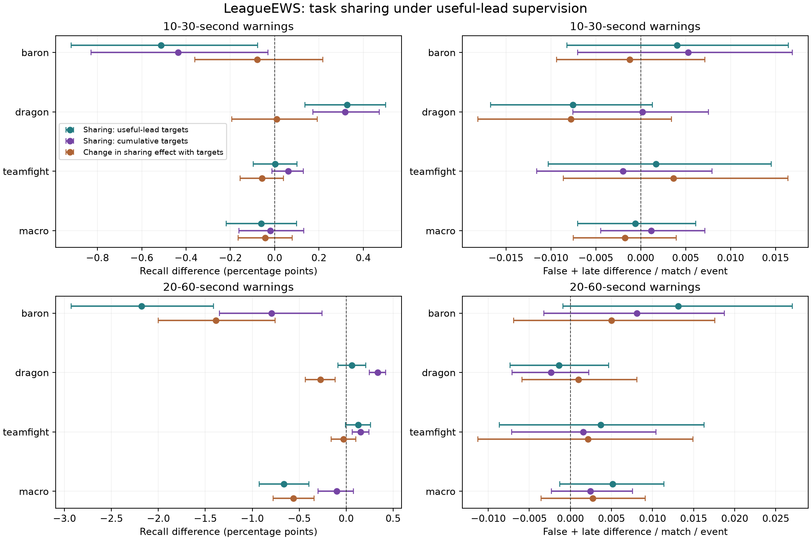

# Useful-lead targets preserve task tradeoffs; longer-lead sharing is adverse

**Completed, 5 October 2026.** Joint learning provides no clear primary macro
recall advantage over independent event models after the useful-lead target
repair: **−0.061 percentage points [conditional paired 95%: −0.219, +0.099]**
at 10–30 seconds. Dragon improves while Baron declines. At 20–60 seconds,
joint learning lowers macro recall by **0.664 points [0.397, 0.925]**, with all
seeds and both regional macro intervals adverse. The target repair benefits
independent models more at longer lead. All four prespecified descriptive
sharing rules fail, and both systems retain regional warning-budget failures.

All nine fits, 234 policy heads, paired analysis and independent audits finished
successfully. There are now **51 completed neural fits** across the continuation.
No worker needs restarting, and patch 16.17 remains sealed.

## Primary result: event tradeoffs survive the target repair

All differences below are joint minus independent using useful-lead targets,
averaged equally over the four fixed matched-early warning budgets. Recall
differences are percentage points. Burden is false-plus-late warnings per match
per event. Seed order is 20260930, 20261001, 20261002.

| Event, 10–30 seconds | Recall difference [95%] | Recall differences by seed | Burden difference [95%] |
|---|---:|---|---:|
| Baron | −0.514 [−0.918, −0.077] | +0.014, −0.537, −1.019 | +0.00407 [−0.00820, +0.01642] |
| Dragon | +0.328 [+0.136, +0.502] | +0.269, +0.490, +0.224 | −0.00754 [−0.01671, +0.00131] |
| Teamfight | +0.003 [−0.096, +0.102] | +0.051, −0.046, +0.004 | +0.00171 [−0.01028, +0.01452] |
| Macro | −0.061 [−0.219, +0.099] | +0.111, −0.031, −0.263 | −0.00059 [−0.00700, +0.00613] |

Mean macro recall is 9.885% joint versus 9.946% independent; mean burden is
0.6263 versus 0.6269. The conditional recall interval crosses zero, and two
seeds are negative. This is neither evidence of a positive sharing effect nor
an equivalence result. Each of the four primary budget-specific macro intervals
also crosses zero. Their mean is not concealing a consistently positive budget.

The Baron penalty is concentrated in Europe: −0.942 [−1.549, −0.288], with
every seed negative, versus Americas −0.090 [−0.633, +0.490]. Dragon gains occur
in both regions with all seeds positive: Europe +0.363 [+0.090, +0.626] and
Americas +0.293 [+0.050, +0.521]. Regional macro effects remain uncertain:
Europe −0.189 [−0.427, +0.051], Americas +0.065 [−0.144, +0.276].

Similar total burden does not mean similar warning composition. Joint learning
adds 0.00497 late warnings per match per event [+0.00240, +0.00744], while its
false-warning change is uncertain at −0.00555 [−0.01174, +0.00077]. Dragon has
0.02272 fewer false warnings but 0.01518 more late warnings. The failed
no-extra-burden rule means its upper confidence bound exceeds zero; it does
not establish that total burden increased.

## Longer lead: independent learning benefits more from aligned targets

| Event, 20–60 seconds | Recall difference [95%] | Recall differences by seed | Burden difference [95%] |
|---|---:|---|---:|
| Baron | −2.180 [−2.928, −1.414] | −1.326, −2.560, −2.653 | +0.01310 [−0.00089, +0.02703] |
| Dragon | +0.060 [−0.089, +0.209] | +0.074, −0.085, +0.192 | −0.00138 [−0.00733, +0.00467] |
| Teamfight | +0.127 [−0.008, +0.258] | +0.178, +0.053, +0.150 | +0.00371 [−0.00867, +0.01626] |
| Macro | −0.664 [−0.925, −0.397] | −0.358, −0.864, −0.770 | +0.00514 [−0.00130, +0.01138] |

Macro recall is 15.448% joint versus 16.112% independent. Every matched-early budget's
longer-lead macro contrast is negative in all three seeds, with each conditional
interval below zero. Both regional macro contrasts are adverse: Europe
−0.901 [−1.267, −0.521] and Americas −0.429 [−0.788, −0.058], with all seeds
negative in both. Baron declines in both regions. Americas teamfight gains
+0.185 [+0.002, +0.357]; the other regional Dragon/teamfight intervals cross
zero. Macro late warnings increase 0.00867 [+0.00596, +0.01129], chiefly Baron,
while the false-warning change remains uncertain.

The two-by-two interaction distinguishes the target repair from sharing:

| Macro recall contrast, points [95%] | 10–30 seconds | 20–60 seconds |
|---|---:|---:|
| Joint minus independent, cumulative labels | −0.019 [−0.161, +0.131] | −0.102 [−0.300, +0.078] |
| Joint minus independent, useful-lead labels | −0.061 [−0.219, +0.099] | −0.664 [−0.925, −0.397] |
| Change in sharing effect with target repair | −0.042 [−0.165, +0.080] | −0.562 [−0.776, −0.343] |
| Target-repair gain, joint models | +0.451 [+0.324, +0.584] | +3.996 [+3.770, +4.248] |
| Target-repair gain, independent models | +0.493 [+0.351, +0.646] | +4.558 [+4.312, +4.826] |

At short lead the interaction is unresolved. At longer lead all interaction
seed signs are negative, as are both regional macro intervals. Baron contributes
−1.386 [−2.001, −0.755] points and Dragon −0.275 [−0.434, −0.119]; teamfight's
interaction crosses zero. The independent target-repair gains are +3.582 points
for Baron, +8.462 for Dragon and +1.631 for teamfights. All three improve in every
seed at longer lead. Target alignment helps both learning recipes, but its gain
cannot be attributed to beneficial sharing.

The larger independent target gain also exchanges late warnings for false
warnings: at longer lead, macro late burden falls 0.12598 [0.11981, 0.13217]
while false burden rises 0.11913 [0.10989, 0.12919]. Total burden changes by
−0.00685 [−0.01692, +0.00385]. This is not an across-the-board reduction in
warning errors.

## Policy sensitivity and practical failures

The finer deterministic common grid supports the main longer-lead concern:
joint minus independent macro recall is −0.554 [−0.826, −0.279] over budgets,
with all seeds negative and **more** burden, +0.0068 [+0.0004, +0.0128].
Its short-lead macro contrast remains
uncertain at +0.039 [−0.125, +0.204]. The coarse common policy gives a positive
short-lead budget mean, +0.207 [+0.039, +0.370], alongside more burden,
+0.0209 [+0.0146, +0.0272]. That secondary result does not replace the primary.

Hard-one failures count event × region × seed cells at budget one:

| Policy / lead window | Joint failures | Independent failures |
|---|---:|---:|
| Matched-early / 10–30 | 12/18 | 10/18 |
| Fine common / 10–30 | 5/18 | 4/18 |
| Matched-early / 20–60 | 7/18 | 6/18 |
| Fine common / 20–60 | 0/18 | 2/18 |

Independent primary matched-early burden reaches 1.05218 warnings per match.
All three Europe Baron cells and all three Americas Dragon cells fail, together
with two Americas Baron cells, one Europe Dragon cell and one Americas teamfight
cell. Across all four matched-early budgets, nominal violations are 42/72 cells
for each family at short lead, and 33/72 joint versus 28/72 independent at longer
lead. Neither family has a hard-one overrun at the lower three matched-early
budgets, but some exceed their own smaller nominal budget. Selecting a policy
from these inspected results would require a separate evaluation.

All four descriptive rules fail: sharing support, event point non-harm,
no-extra-burden and regional sharing consistency. Fewer failures for an
independent system at one policy do not establish practical promotion or
resource-matched superiority. All failures remain in [budget-violations.csv](budget-violations.csv).

## Question and controlled comparison

The original LeagueEWS report attributes gains to temporal buildup and shared
learning across Baron, Dragon and teamfights. Earlier history controls support
a modest contribution from past non-timing state at short lead. The earlier
sharing comparison used cumulative labels, whereas later target repairs train
the evaluated heads to reward warnings with useful lead time. This study
completes the missing fourth cell:

| Evaluated training targets | Joint encoder | Independent event encoders |
|---|---|---|
| Cumulative next-event horizons | Completed original control | Completed sharing control |
| Useful lead intervals | Completed target-repair control | Nine new fits in this study |

The primary comparison is useful-lead joint minus independent macro recall
with 10–30 seconds of lead, averaged equally across four fixed matched-early
warning budgets. The secondary interaction is the useful-lead sharing effect
minus the cumulative-label sharing effect. A positive interaction means the
target repair benefits the joint recipe more; it does not imply that joint
learning itself helps. Both component effects are therefore reported alongside
the interaction. The analysis checks the equivalent difference of target
effects in every point estimate and shared bootstrap draw.

Each independent fit retains the joint encoder's per-event capacity, initial
seed, dropout consumption, inputs, masks, normalizer, batch order, original
event loss weight, optimizer and twelve epochs. Only one event supervises each
encoder. Evaluated 30/60-second columns use next-event delays in [10,30]/[20,60]
seconds; cumulative 10/20-second auxiliaries remain. The independent system
requires three encoders and 5,248,773 active parameters per seed, versus
1,751,647 parameters in the joint model. Resources are not equalized. This
comparison cannot separately identify gradient interference, loss scaling,
representation competition or causal gameplay mechanisms.

## Execution and evidence boundaries

The interrupted study resumed from three completed Baron fits and unit 417 of
the first Dragon fit. The [recovery record](recovery-record.json) preserves that
observation. The valid checkpoint supplied the recovery position; the prior
log was truncated, and the cause of interruption was not established. Frozen
training sources, all 24 declared analysis sources and the plan were verified.
All nine checkpoint hashes remained unchanged through scoring.

Analysis commit `570b10c` preceded the [explicit scoring release](scoring-release-gate.json).
The training worker first exited successfully with all nine fits complete and
zero new scores. Scoring began only after the release bound the plan, training
freeze and committed analysis sources. This study follows the enforced ordering
introduced after the preceding study's disclosed timing deviation; the old
deviation remains in the record.

Nine fits completed 5,184 checkpointed shard units with 105.52 aggregate
training minutes, including work before recovery. Both training and evaluation
exited successfully. The [execution record](execution-record.json) verifies
108,000 full-match reference checks and 89,869 component checks. All 216 previous
heads reproduce every one of the five policy count arrays exactly; 28,800 prior
model and 31,200 shared-contrast metric records are also exactly reproduced.
All 234 early heads were frozen with zero later evaluations at the
[early-policy gate](evaluation-gate.json).

The unchanged League development archive contains 24,000 training matches on
patches 16.12–16.15 and 6,000 calibration matches on 16.16. Policies use the
earlier 3,000 calibration matches; evaluation uses the later 3,000, with 1,500
per region. Five fixed policy families, four budgets and both lead windows
are retained. Later replay and the audit completed for every declared head.

Uncertainty uses 2,000 paired whole-match bootstrap draws stratified by region.
All models, events, budgets and fixed seeds share the same match draws. Seeds,
rows and budgets are not independent observations. Intervals are pointwise,
unadjusted and conditional on fitted models and selected policies; they omit
refitting, adaptive-search, policy-selection and realized mixture-randomization
variance. Shared-player dependence is not identifiable from this archive.
These calibration matches have informed earlier research decisions.

The original registered LeagueEWS-minus-GRU comparison and every failed
regional warning gate remain preserved. Baron and Dragon labels identify
objective completions, not engagement onset. Patch 16.17 stays sealed. This
is an exploratory comparison of training recipes, not fresh confirmation or
evidence for a new multitask method. The [literature review](literature.md)
records established related methods and the limits of the novelty search.

## What this changes in the research argument

The original registered coarse-common budget-one LeagueEWS-minus-GRU result
remains +4.623 [+4.223, +5.064] points at short lead and −0.843 [−1.358, −0.307]
at longer lead. Its failed practical gate remains. The original short-lead
LeagueEWS-minus-TCN result remains +0.012 [−0.156, +0.178]. These are different
estimands from the matched-early four-budget contrasts above; the new analysis
does not rewrite them.

Past non-timing state still supports the earlier +0.533-point short-lead history
finding. Shared learning now has a direct aligned-target control: it helps
short-lead Dragon, harms Baron, and yields a clear longer-lead macro penalty
under this recipe. This narrows the original explanation to event- and
lead-dependent tradeoffs. It supplies no basis for claiming a universal sharing
benefit, a new optimizer mechanism or a breakthrough.

A useful next experiment would distinguish task-loss scaling from cross-task
interference under the useful-lead targets, with controls and reporting rules
fixed from training/early-calibration evidence. The cumulative-label PCGrad
result cannot answer that question for the new targets. Any task-protection
method needs relevant established controls and an explicit resource comparison.
No best-event ensemble, extra fit, policy retuning or test release was performed
after these results.

The committed source had passed 653 tests (one skipped), 85.89% coverage, Ruff
and mypy for 87 source files before scoring; existing draft CI also passed.
No frozen implementation changed during recovery, scoring or analysis.
These software checks are distinct from the empirical replay and parity audits.

[Protocol](protocol.md), [plan](plan.json), [audit](audit.md),
[reproduction instructions](reproduce.md), [complete tables](tables.md),
[aggregate analysis](analysis.json) and [published artifact hashes](published-artifacts.json)
preserve the results. Private scores, matches and model binaries stay local.

