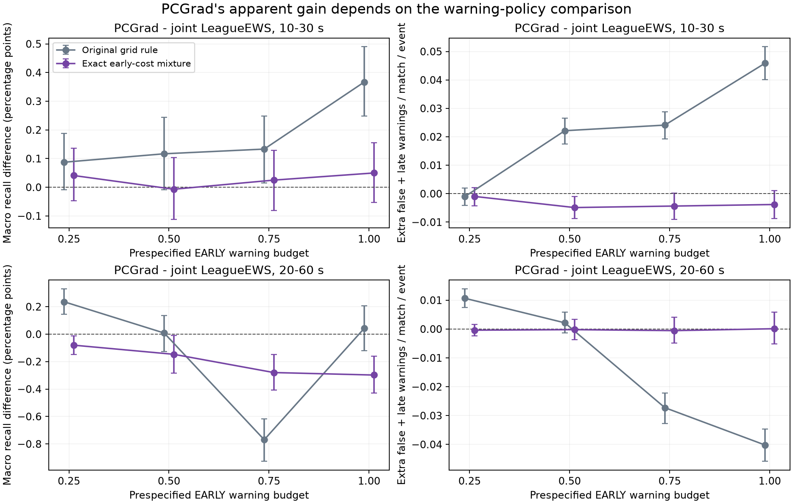
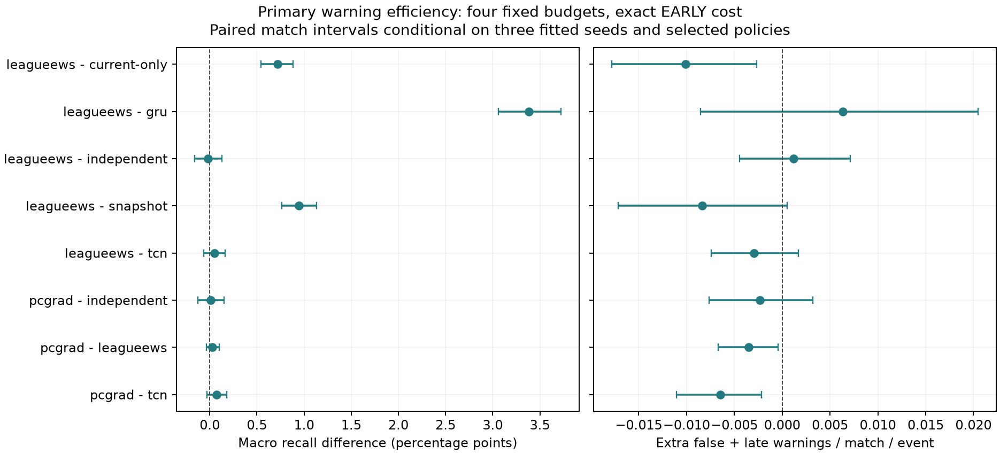

# League warning-efficiency follow-up — 3 October 2026

**No breakthrough established.** PCGrad's primary gain is not robust to the
prespecified warning-policy diagnostic. With expected early cost matched, its
four-budget macro recall difference from ordinary joint LeagueEWS is **+0.027
percentage points, paired 95% interval −0.036 to +0.098**. One of three seeds is
negative. The 20–60-second difference is **−0.201 points [−0.300, −0.103]**,
negative in every seed and at every budget. The frozen promotion screen fails.
These are exploratory development results, not evidence of equivalence or a
confirmatory test. Patch 16.17 remains sealed.

## What completed

All 27 previously fitted neural models remain intact: 12 original fits, three
history ablations, nine independent event encoders and three PCGrad fits, each
at 576/576 shard updates (15,552 updates in total). The original GPU study's
`data/private/compact-notebook-v1/summary.json` exists. Its worker was already
finished; no duplicate training or new neural fit was launched. The follow-up
reused saved scores on CPU and completed 126 event/seed/horizon heads, two
policies and four budgets: **1,008 evaluated combinations on 3,000 unique later
calibration matches**. No worker remains active for this study.

Protocol and runner were committed at `f304d73`; every early policy was frozen
at 17:28:19 UTC. Paired analysis was committed at `3ec6fc1` before first later
evaluation at 17:30:27. All later heads completed by 17:30:40. Provenance is in
[evaluation-gate.json](evaluation-gate.json) and
[execution-record.json](execution-record.json). Test-payload accesses: zero.

## Comparison and uncertainty

The plan fixes budgets of 0.25, 0.50, 0.75 and 1.00 false-plus-late warnings per
match, per event and region. The deterministic control uses the original
threshold grid and regional constraint. The diagnostic chooses a region-specific
mixture of at most two of those thresholds, maximizing early timely recall at
**exact expected early cost**. One threshold would be sampled independently at
match start and held throughout that match. Expected whole-match counts are
computed analytically, preserving cooldown and one-to-one event credit.

The mixture adds region-specific selection and randomization for every model.
Consequently, this is a policy sensitivity analysis; it does not isolate cost
matching alone from those additional choices. Early equality does not guarantee
later equality. Forcing equality can also spend a budget unnecessarily. This is
not a deployment recommendation or a new method; see the targeted
[primary-source check](literature.md).

All models use three fixed seeds, all three events, both regions and both lead
windows. Intervals use 2,000 paired whole-match bootstrap draws stratified by
region, sharing weights across models, seeds, events, policies and budgets.
Budget means average four fixed operating points, not four match populations.
Intervals condition on fitted models, early policies and the expectation over
policy randomization. They exclude refitting, policy-selection, adaptive-search
and realized randomization uncertainty. Numerous pointwise intervals are
unadjusted; calibration has already informed research choices.

## Primary recall and warning burden

The table averages the four matched-early budgets and three fixed seeds. Each
cell is **timely event recall (%) / false-plus-late warnings per match**. Objective
labels mark Baron/Dragon completions; teamfights use the frozen event definition.
The primary useful lead interval is 10–30 seconds.

| Family | Baron | Dragon | Teamfight | Macro |
|---|---:|---:|---:|---:|
| LeagueEWS | 16.321 / 0.6361 | 9.559 / 0.6419 | 2.424 / 0.6160 | 9.435 / 0.6313 |
| GRU | 9.071 / 0.6161 | 7.145 / 0.6467 | 1.944 / 0.6121 | 6.054 / 0.6250 |
| TCN | 16.127 / 0.6505 | 9.688 / 0.6419 | 2.346 / 0.6104 | 9.387 / 0.6343 |
| Snapshot | 14.060 / 0.6322 | 9.235 / 0.6490 | 2.166 / 0.6378 | 8.487 / 0.6397 |
| Current-only ablation | 14.455 / 0.6380 | 9.474 / 0.6453 | 2.224 / 0.6411 | 8.718 / 0.6414 |
| Independent encoders | 16.757 / 0.6308 | 9.241 / 0.6417 | 2.363 / 0.6180 | 9.453 / 0.6301 |
| PCGrad | 16.355 / 0.6371 | 9.610 / 0.6362 | 2.420 / 0.6102 | 9.462 / 0.6278 |

PCGrad−joint event recall differences are Baron +0.034 [−0.139, +0.221], Dragon
+0.051 [−0.033, +0.140], and teamfight −0.003 [−0.045, +0.037] points. None has a
positive conditional lower bound. Macro burden is slightly lower:
−0.00350 [−0.00668, −0.00042]. This does not demonstrate higher recall at equal
later cost. PCGrad also has no clear primary macro gain over TCN, +0.075
[−0.028, +0.181], or independent encoders, +0.008 [−0.127, +0.154].

Under the original deterministic rule, PCGrad−joint retains +0.176
[+0.106, +0.250] points averaged across budgets, while spending an extra 0.02277
warnings per match per event. At budget 1 its earlier +0.367-point result is
reproduced exactly. The new diagnostic weakens an efficiency interpretation of
that result; it does not prove that every difference was caused by warning cost.

Bars are conditional paired 95% intervals. Left panels show recall; right panels
show the corresponding later burden difference. All prespecified points are
shown, including the adverse longer-lead result.

## Regional failures and seeds

Primary budget-mean PCGrad−joint recall differences are +0.041 points in Europe
[−0.056, +0.140] and +0.014 in Americas [−0.081, +0.112]. Neither region establishes
a gain. Seed differences are +0.0907, −0.0331 and +0.0239 points, in chronological
seed order. PCGrad macro recall itself spans 9.410–9.523%, sample SD 0.0573 points;
joint spans 9.428–9.443%, SD 0.00784. Three fits describe limited training
variability and do not constitute independent match replications.

At nominal budget 1, **12 of 18 PCGrad primary region/event/seed cells exceed the
hard limit of one**. Examples include Europe Dragon in all three seeds
(1.0075, 1.0178, 1.0042), Americas Baron in all seeds (1.0408, 1.0534, 1.0327), and
Americas teamfight in seeds 20260930 and 20261002 (1.0628, 1.0266). Across all
2,016 regional cells in the two-policy study, 722 exceed their nominal budget;
189 exceed one. All failures are retained in
[budget-violations.csv](budget-violations.csv), not hidden by seed averages.

The frozen positive-recall, consistent-across-budgets, mean-no-event-harm and
regional-hard-budget gates fail; the no-extra-mean-burden gate passes. The tiny
negative mean teamfight difference mechanically fails the no-harm rule but its
interval does not establish material harm. No post-result margin is substituted.

## What the comparisons establish about mechanism

- **History:** Full history beats the trained current-only ablation by +0.717
  primary macro points [+0.543, +0.881], positive in every seed, with lower mean
  later burden. Baron contributes +1.866 points and teamfight +0.200; Dragon's
  +0.085 interval crosses zero. This supports useful past state information
  under the fixed architecture. It does not identify which channels or whether
  long sequence order, short-term changes, or smoothing supplies that benefit.
  The longer-lead macro difference +0.079 [−0.118, +0.262] is not clear.
- **Architecture:** LeagueEWS exceeds GRU (+3.381 macro points) and snapshot
  (+0.948), but its primary TCN difference is +0.048 [−0.063, +0.161]. This does
  not establish a hybrid-specific advantage. These architectures also differ in
  capacity and optimization. The positive secondary LeagueEWS−TCN difference
  +0.298 [+0.153, +0.433] does not replace the primary result.
- **Task sharing:** Joint−independent primary macro is −0.019 [−0.161, +0.131].
  The event tradeoff persists: Baron −0.436 [−0.830, −0.030], negative in all
  seeds; Dragon +0.319 [+0.173, +0.473], positive in all seeds. Independent
  encoders have matched per-event width but about three times total encoder
  storage/compute. This is evidence about the shared recipe, not proof that
  gradient conflict, representation competition or loss scaling is its cause.
- **PCGrad:** Neither this diagnostic nor the earlier training-gradient probe
  establishes gradient conflict as the causal explanation. PCGrad changes
  gradient direction and magnitude; its useful-recall superiority fails this
  screen. Record this as a negative result, not a new transfer mechanism.

## Registered result, next decision and reproducibility

The original LeagueEWS−GRU primary comparison remains **+4.623 points
[+4.223, +5.064]**, positive in all three seeds, with its **failed regional budget
gate**. It supports a recall difference for these fits, not a successful overall
practical screen. Every original threshold and all 378,000 original head-match
count vectors reproduce exactly; 960 original aggregate estimates/intervals
also reproduce exactly. Independent sequential replay additionally checks
26,226 component-threshold/match combinations for the new policies.

Do not promote PCGrad or resume blind architecture search from these results.
The defensible remaining mechanism question is **which historical information
supports the reproducible primary benefit**. A trained, capacity-matched history
compression or channel ablation could distinguish explanations; the current
comparisons cannot. No such next fit or confirmatory test is claimed as completed
here. It would require its own frozen intervention and strong controls. A
breakthrough would additionally require meaningful effects, a defensible novelty
argument and untouched-data generalization; repeated calibration search cannot
supply those by itself.

[Reproduction instructions](reproduce.md), [complete tables](tables.md),
[analysis.json](analysis.json), [seed points](by-seed.csv),
[aggregate counts](aggregate-counts.csv), [early policies](early-policies.json)
and the frozen plan preserve the evidence. Validation: 604 tests passed,
one skipped, 85.89% coverage; Ruff and strict mypy passed. Private match arrays,
predictions, checkpoints and test payloads are excluded from publication.
