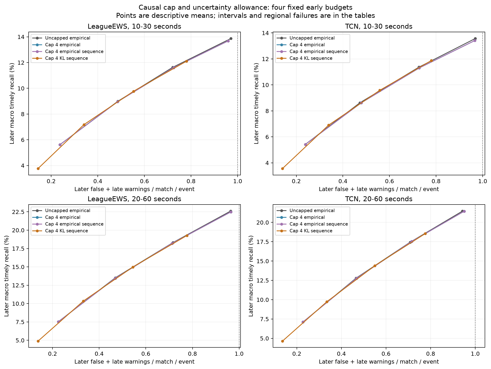
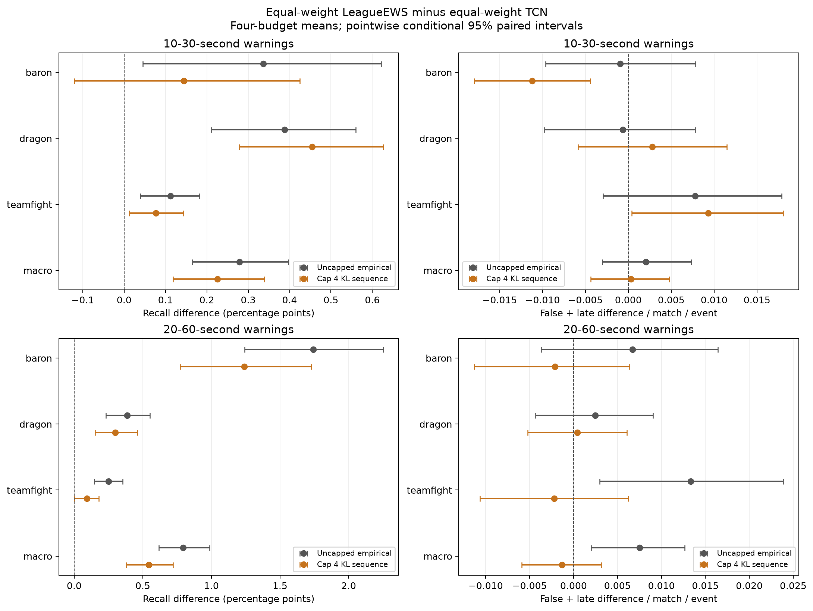

# Warning budgets with a causal cap and uncertainty allowance

**Complete, 7 October 2026; exploratory development only.** The fixed
risk-screened policy has **zero nominal-budget violations in all 720
event/region/seed/budget/model/window cells**, without selecting silence.
This addresses the observed budget failures by operating more conservatively:
equal-weight LeagueEWS loses **1.818 macro recall points [1.734, 1.908]** at
10–30 seconds and **3.114 points [3.010, 3.223]** at 20–60 seconds relative
to the unchanged fine-grid policy, averaged across four budgets.

LeagueEWS retains a primary advantage over equally weighted TCN, +0.225
recall points [0.118, 0.340], positive in all three seed means. Europe's
interval still crosses zero and the no-extra-burden rule still fails. The
result is a quantified warning-cost tradeoff, not a breakthrough, a new
prediction method or a certified release. All 69 neural fits remain unchanged;
this study adds no fit. Patch 16.17 stays sealed.

## Fixed comparison

The [protocol](protocol.md), code, paired analysis and 36 new tests were
committed as `3b382337c4b4a8fb4a699d31e22a4506828998d2` before selecting
any new early policy. The study reuses equal-weight useful-lead LeagueEWS,
TCN and GRU, useful-lead independent event encoders, and original-weight
useful-lead LeagueEWS. It retains all three original seeds, all three events,
both lead windows and both regions. Baron and Dragon are objective completions;
teamfight keeps its registered kill-episode target.

Four common-threshold policies distinguish the mechanisms:

| Policy | Selection and warning behavior |
|---|---|
| Uncapped empirical | Exact previous fine-grid policy; maximize early timely hits subject to each region's empirical warning budget |
| Capped empirical | Same selection objective, stop after four chronological warnings per event/head/match |
| Capped empirical sequence | Same cap; restrict candidates to the descending-threshold prefix before the first empirical regional budget failure |
| Capped KL sequence | Same cap and order, but require each region's bounded-loss test to pass before continuing |

The 1,002-entry grid, 60-second cooldown, budgets 0.25/0.5/0.75/1.0 and tie
rule are fixed. The cap uses emitted warnings only, without future labels,
future scores or match duration. All events remain in the recall denominator.
The windows are evaluated separately; the result does not describe running
both horizon policies simultaneously in a deployed product.

The uncertainty allowance uses the Hoeffding KL bound with loss normalized
by the structural maximum of four warnings. Error level 0.05 is allocated
across 720 fixed regional sequences; each receives 0.05/720. The sequence
stops at the first failed test and never skips a failure to find a favorable
threshold. This applies an existing risk-control approach; the
[protocol's primary-source comparison and assumptions](protocol.md#statistical-provenance-and-limitations)
explain why cooldown cost cannot simply be assumed monotone.

## Practical outcome and recall cost

Each policy has 360 regional cells per lead window: five families × three
seeds × three events × two regions × four budgets. Counts below retain all
models, including weak controls; they are not independent statistical samples.

| Policy | Nominal violations, 10–30 s | Hard-one violations, 10–30 s | Nominal violations, 20–60 s | Hard-one violations, 20–60 s |
|---|---:|---:|---:|---:|
| Uncapped empirical | 68 | 21 | 46 | 10 |
| Capped empirical | 60 | 14 | 45 | 12 |
| Capped empirical sequence | 60 | 14 | 45 | 12 |
| Capped KL sequence | **0** | **0** | **0** | **0** |

The maximum later regional cost under the risk-screened policy is 0.1687,
0.3847, 0.6167 and 0.8540 at the four short-lead budgets; longer-lead maxima
are 0.1687, 0.3933, 0.6040 and 0.8400. Every family uses a non-silent
threshold at all 360 head/budget settings. The new empirical hard-one rule
passes for equal-weight LeagueEWS in both windows. Previously frozen policy
failures remain failures; this new policy does not change their outcomes.

The cost of this improvement is substantial:

| Equal-weight LeagueEWS policy | Short-lead macro recall / burden, four-budget mean | Longer-lead macro recall / burden, four-budget mean |
|---|---:|---:|
| Uncapped empirical | 10.025% / 0.6037 | 15.488% / 0.5935 |
| Capped empirical | 9.965% / 0.6017 | 15.411% / 0.5925 |
| Capped empirical sequence | 9.965% / 0.6017 | 15.411% / 0.5925 |
| Capped KL sequence | 8.206% / 0.4546 | 12.374% / 0.4477 |

The total paired short-lead effect is −1.8184 recall points
[−1.9076, −1.7338] and −0.1491 [−0.1542, −0.1445] false-plus-late warnings
per match per event. The longer-lead effect is −3.1142 points
[−3.2226, −3.0101] and −0.1458 [−0.1510, −0.1410] warnings. Recall falls
in every seed in both windows; all three event recall intervals are adverse.
Most of the change comes from the uncertainty allowance, not clipping the
warning tail or restricting the threshold order.

At budget one, short-lead recall moves from 13.865% to 12.109% while burden
moves from 0.9706 to 0.7809. Longer-lead recall moves from 22.598% to 19.271%
and burden from 0.9635 to 0.7761. The corresponding paired recall differences
are −1.7569 [−1.8948, −1.6148] and −3.3265 [−3.5410, −3.1240] points.
These points cannot be described as recall gains at equal achieved cost.

## Which mechanism mattered

The cap-only four-budget macro recall change is −0.0602
[−0.1102, −0.0134] short-lead points and −0.0770 [−0.1496, −0.0108]
longer-lead points. Its burden effects are small and uncertain. Re-selecting
thresholds after capping can offset the warning reduction and can increase
some later costs: total longer-lead hard-one violations rise from 10 to 12.
A four-warning cap bounds each match's loss by four, not by one.

The capped empirical and capped empirical-sequence policies select **exactly
the same thresholds for all 90 heads and four budgets**. Their observed policy
effect is exactly zero. This does not prove the underlying cost function is
monotone; it means the prefix restriction did not change these selections.

Adding the KL allowance then costs −1.7582 [−1.8368, −1.6828] short-lead
macro recall points and −3.0371 [−3.1374, −2.9360] longer-lead points,
relative to the capped empirical sequence. Burden falls by −0.1471
[−0.1514, −0.1431] and −0.1448 [−0.1488, −0.1411]. The plotted operating
points mostly follow the previous recall–burden relationship. This is evidence
of more conservative operation; an improved prediction frontier is not shown.

At budget one, the cap truncates 301 of 27,000 later match/event/seed cells
for risk-screened LeagueEWS at short lead and 542 at longer lead. Under capped
empirical selection the corresponding counts are 601 and 1,092. These are
repeated cells across events and seeds, not unique matches. Truncation means
the same threshold would have emitted more than four warnings without the cap.

Pooled event precision at budget one also remains limited. For short-lead
LeagueEWS, Baron/Dragon/teamfight timely precision changes from
19.396%/37.427%/21.573% to 21.235%/38.856%/22.084%. At longer lead it changes
from 24.825%/54.259%/34.455% to 25.343%/56.045%/35.435%. These are descriptive
ratios pooling the three seeds' counts, not additional independent matches.

## Matched architecture evidence under the new policy

All intervals are pointwise conditional 95% intervals using the same 2,000
region-stratified paired whole-match bootstrap draws. Training seeds are
fixed. Within-model policy effects and between-model comparisons are formed
inside each draw. Four-budget means average operating points. The intervals
omit model-fitting, policy-selection and adaptive research-search uncertainty.

| Equal-weight LeagueEWS minus TCN | Recall difference, points [95%] | Seed differences |
|---|---:|---|
| Primary macro, 10–30 s | +0.2252 [0.1184, 0.3396] | +0.1280, +0.2765, +0.2711 |
| Baron, 10–30 s | +0.1440 [−0.1207, 0.4252] | +0.2391, +0.0849, +0.1080 |
| Dragon, 10–30 s | +0.4546 [0.2784, 0.6263] | +0.0993, +0.6841, +0.5804 |
| Teamfight, 10–30 s | +0.0770 [0.0131, 0.1438] | +0.0455, +0.0606, +0.1250 |
| Macro, 20–60 s | +0.5432 [0.3795, 0.7193] | +0.6516, +0.5648, +0.4133 |
| Baron, 20–60 s | +1.2393 [0.7708, 1.7287] | +1.2265, +1.3730, +1.1185 |
| Dragon, 20–60 s | +0.2986 [0.1519, 0.4588] | +0.5693, +0.3884, −0.0618 |
| Teamfight, 20–60 s | +0.0918 [0.0000, 0.1789] | +0.1591, −0.0669, +0.1831 |

Europe's primary macro contrast is +0.0969 [−0.0615, 0.2548]; the Americas
contrast is +0.3523 [0.1983, 0.5036]. Both have positive macro seed means,
but Europe's interval crosses zero. Its Baron and teamfight point contrasts
are negative (−0.0828 and −0.0134 points), with two adverse seeds each.
Thus the regional-consistency rule fails. Both longer-lead regional macro
intervals are positive, while event-level uncertainty and adverse seeds persist.

The primary macro burden contrast is +0.00031 [−0.00440, 0.00480], so the
no-extra-burden rule fails. An interval spanning zero does not prove equality
or harm. Short-lead teamfight burden does increase: +0.00931 [0.00042, 0.01806].
The macro recall interval is positive at each short-lead budget, but budget
one has one negative seed (−0.0072 points). At longer lead the lowest budget
has one negative seed. The four-budget primary is not a uniform guarantee.

LeagueEWS exceeds equal-weight GRU by +4.0594 [3.8117, 4.3408] and +6.4467
[6.1062, 6.7974] macro points. This retains the earlier fixed-GRU-recipe
limitations. Against independent encoders, LeagueEWS gains +0.3279
[0.1817, 0.4733] short-lead macro points, but its longer-lead difference is
−0.1687 [−0.3936, 0.0617]. Longer-lead Baron loses −0.7739
[−1.3986, −0.1320], negative in all seeds. Equal weighting still improves
LeagueEWS relative to its original weights under the same risk policy.

## What the practical pass does and does not establish

The primary architecture, event point non-harm and secondary GRU rules pass.
Both new empirical hard-one endpoints pass. The no-extra-burden and regional
architecture-consistency rules fail. Event point non-harm is not an event-wise
noninferiority result. All original failed gates remain in the record.

The nominal risk-control argument requires an appropriate fixed predictor and
IID calibration/test matches. These models and research choices were adapted
to repeatedly inspected calibration. The study therefore does **not** certify
the nominal error guarantee for this research search. Chronological splits
and a future patch need not be identically distributed. Even under valid
assumptions, a population expected-risk bound does not guarantee every realized
regional average or individual match is below the nominal budget. Only the
four-warning cap is structural and independent of future outcomes.

## Audit and reproducibility

All 90 early heads were selected and hash-frozen before any new later replay.
The [execution record](execution-record.json) confirms the committed analysis
preceded release and the first early policy (14:30:40 UTC). The first later
counts followed at 14:35:36 UTC; audit completed at 14:36:16 UTC. Local
timestamps are evidence of local order, not external preregistration.

All **810,000 full independent scalar replay checks** passed, covering
90 heads × 3 new policies × 3,000 later matches at budget one. Another 25,699
component checks covered selected thresholds. All 90 unchanged fine-grid
baseline heads reproduce exactly, as do 150 model and 150 shared-contrast
event/metric groups from the preceding analysis. No checkpoint or old study
was modified. The quality gate records 740 passed tests, one skipped, 85.86%
source coverage, 36 new focused tests, Ruff, mypy on 87 files, shell syntax
and the secret check. The two standalone figures were visually inspected.

[tables.md](tables.md) retains all event, region, seed, model and policy
comparisons; [analysis.json](analysis.json) contains complete conditional
intervals and cap activity; [budget-violations.csv](budget-violations.csv)
lists every nominal-budget violation. Aggregate counts and by-seed tables,
frozen selected policies, hashes and [reproduction instructions](reproduce.md)
are included. The raw analysis hashes survive publication formatting.

## Consequence for continuation

The fixed uncertainty allowance prevents observed budget overruns but leaves
a large recall cost and a limited regional architecture claim. Further work
should test whether a less conservative, still explicitly bounded risk
selector can recover recall without losing the observed budget control. It
must retain the same cap, models, grid, sequence order, error allocation and
all comparison cells to isolate the uncertainty calculation. Any such result
remains development evidence; fresh confirmation is still required.
